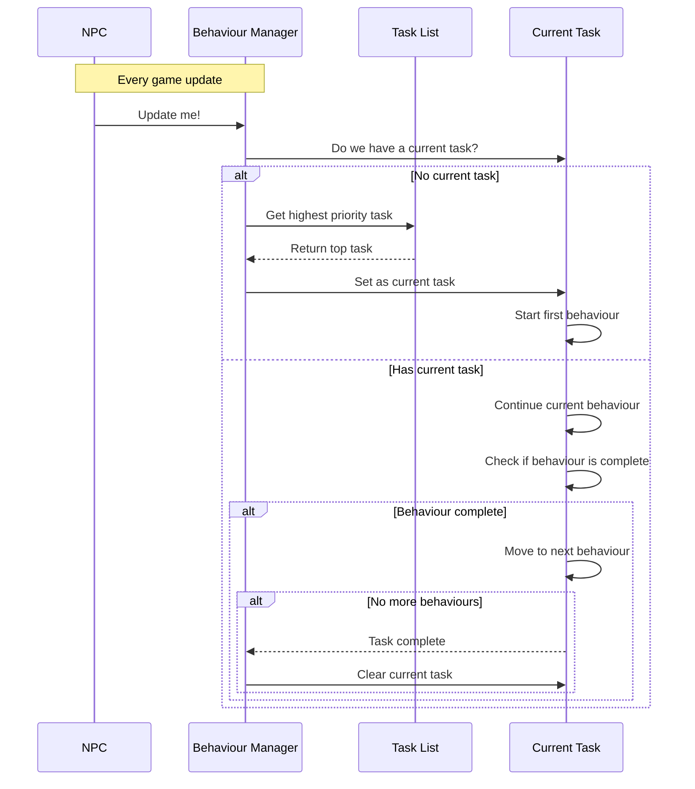

# Chapter 1: Behaviour System

## Introduction

Imagine you're creating a video game with AI characters that need to make their own decisions - like enemies in an adventure game or townspeople in a role-playing game. How do you make these NPCs (Non-Player Characters) act intelligently without writing tons of complicated code? That's where the **Behaviour System** comes in!

In this chapter, we'll learn about a simple but powerful framework that helps our AI characters decide what to do and when to do it. Think of it as creating a smart to-do list manager for your game characters.

## The Problem: Making NPCs Act Realistically

Let's start with a common scenario: You have an enemy guard in your game. This guard needs to:

- Patrol an area when everything is normal
- Attack the player when they get too close
- Run away when badly injured
- Sometimes just stand and look around

Without a good system, coding all these behaviors and their transitions would be messy and difficult to manage. The Behaviour System gives us a clean way to organize these actions and handle the decision-making.

## Key Concepts of the Behaviour System

Let's break down the main elements using everyday analogies:

### 1. Behaviours: The Individual Actions

A **Behaviour** is like a single instruction on a to-do list. It's one specific action an NPC can take, such as "move to this location" or "attack that character."

Each behaviour has:
- A **type** (Wait, Go, Attack, etc.) - What kind of action to perform
- A **duration** - How long the action should last
- A **target** - What or who the action is directed at

Think of a behaviour like "Go to the grocery store for 30 minutes" - it has a type (Go), duration (30 minutes), and target (grocery store).

### 2. Tasks: Sequences of Behaviours

A **Task** is like a multi-step errand. It's a sequence of behaviours that accomplish a goal.

For example, a "pursue and attack" task might include:
1. Go to the player
2. Attack the player

Tasks also have **priority levels** - just like in real life, where you might drop what you're doing if there's an emergency.

### 3. Behaviour Manager: The Decision Maker

The **Behaviour Manager** is like a personal assistant that:
- Keeps track of all the tasks in order of importance
- Decides which task to execute next
- Makes up small tasks when there's nothing urgent to do (like how you might check your phone when bored)

## Understanding the Behaviour System Code

Let's look at the core components in code. Don't worry about understanding every detail - focus on the overall structure.

### Behaviour Types

First, the system defines various types of behaviors an NPC can perform:

```csharp
public enum BehaviourType
{
    Wait,       // Just wait in place
    HangAround, // Casually move around an area
    Go,         // Move to a specific target
    Attack,     // Attack a target
    Defend,     // Defend against threats
    Follow,     // Follow a target
    Escape,     // Run away from danger
    // And more...
}
```

This is just a list of different actions our AI characters can take. You can think of these as verbs in the AI's vocabulary.

### Creating a Simple Behaviour

Here's how we might create a simple "go somewhere" behaviour:

```csharp
// Create a new behaviour to go to position (10,0,0) for up to 5 seconds
Vector3 destination = new Vector3(10, 0, 0);
Behaviour moveBehaviour = new Behaviour(
    BehaviourType.Go,      // Type: Go to a location
    5.0f,                  // Duration: 5 seconds maximum
    TargetType.Point,      // Target type: A point in space
    destination            // Target data: The position to go to
);
```

This code creates an instruction for an NPC to move to a specific point for up to 5 seconds.

### Creating a Task with Multiple Behaviours

Now let's create a more complex task with multiple steps:

```csharp
// Create a new patrol task
Task patrolTask = behaviourManager.AddTask(1.0f); // Priority 1 (low)

// Add series of behaviors: go to point A, wait, go to point B, wait
Vector3 pointA = new Vector3(10, 0, 0);
Vector3 pointB = new Vector3(-10, 0, 0);

patrolTask.AddBehaviour(new Behaviour(BehaviourType.Go, 5, TargetType.Point, pointA));
patrolTask.AddBehaviour(new Behaviour(BehaviourType.Wait, 2));
patrolTask.AddBehaviour(new Behaviour(BehaviourType.Go, 5, TargetType.Point, pointB));
patrolTask.AddBehaviour(new Behaviour(BehaviourType.Wait, 2));
```

This creates a patrol routine where the NPC will:
1. Go to point A
2. Wait for 2 seconds
3. Go to point B
4. Wait for 2 seconds

## How the System Works: A Visual Explanation

Let's visualize how the Behaviour System makes decisions:



This diagram shows:
1. Each game update, the Behaviour Manager checks if it has a current task
2. If not, it picks the highest priority task from the list
3. It executes the current behaviour in the task
4. When a behaviour completes, it moves to the next behaviour
5. When all behaviours in a task are done, it moves to the next task

## Example: Creating a Guard NPC

Let's see a practical example of how to use the Behaviour System to create a simple guard NPC.

### Step 1: Setting Up Basic Patrol

First, we set up a low-priority patrol task:

```csharp
// Create a manager for our guard NPC
NpcController guardController = GetComponent<NpcController>();
BehaviourManager manager = new BehaviourManager(guardController);

// Add a low-priority patrol task
Task patrolTask = manager.AddTask(0.5f);
patrolTask.AddBehaviour(new Behaviour(BehaviourType.Go, 10, TargetType.Point, pointA));
patrolTask.AddBehaviour(new Behaviour(BehaviourType.Wait, 3));
patrolTask.AddBehaviour(new Behaviour(BehaviourType.Go, 10, TargetType.Point, pointB));
patrolTask.AddBehaviour(new Behaviour(BehaviourType.Wait, 3));
```

### Step 2: Adding Player Detection and Attack

When the guard spots the player, we add a higher-priority attack task:

```csharp
// When player detected
void OnPlayerDetected(UniObjectData playerData)
{
    // Create a higher priority attack task
    Task attackTask = manager.AddTask(2.0f);
    
    // First go to the player
    attackTask.AddBehaviour(new Behaviour(
        BehaviourType.Go, 
        5, 
        TargetType.Character, 
        playerData
    ));
    
    // Then attack the player
    attackTask.AddBehaviour(new Behaviour(
        BehaviourType.Attack, 
        3, 
        TargetType.Character, 
        playerData
    ));
}
```

Because the attack task (priority 2.0) has higher priority than the patrol task (priority 0.5), the guard will interrupt patrolling to pursue and attack the player.

### Step 3: Adding Escape When Injured

If our guard gets hurt, we want them to run away:

```csharp
// When guard takes damage
void OnTakeDamage(float healthRemaining)
{
    if (healthRemaining < 0.3f) // Less than 30% health
    {
        // Create highest priority escape task
        Task escapeTask = manager.AddTask(5.0f);
        
        // Find safe position and run there
        Vector3 safePosition = FindSafePosition();
        escapeTask.AddBehaviour(new Behaviour(
            BehaviourType.Escape, 
            8, 
            TargetType.Point, 
            safePosition
        ));
    }
}
```

This escape task will override even the attack task because of its higher priority (5.0 > 2.0).

## The Auto-Pilot Feature: Spare Time Tasks

One clever feature of the Behaviour System is that NPCs can generate their own tasks when they have nothing important to do. Look at this method from the code:

```csharp
void CreateSpareTimeTask()
{
    task = AddTask(0.25f);
    switch (Random.Range(0, 5))
    {
        case 0: // Look at something random
            UniObjectData target = controller.GetRandomTarget();
            task.AddBehaviour(new Behaviour(BehaviourType.LookAt, 
                Random.Range(1, 3), TargetType.Character, target));
            break;
            
        case 1: // Just wait a bit
            task.AddBehaviour(new Behaviour(BehaviourType.Wait, 
                Random.Range(0, 1)));
            break;
            
        case 2: // Wander around
            Vector3 position = controller.GetRandomPosition();
            task.AddBehaviour(new Behaviour(BehaviourType.HangAround, 
                Random.Range(2, 4), TargetType.Point, position));
            break;
        // More options...
    }
}
```

This creates realistic idle behavior - NPCs will look around, wait, or wander when they have nothing specific to do, just like real people!

## Practical Tips for Using the Behaviour System

1. **Set Appropriate Priorities**: Make sure important actions like responding to danger have higher priorities than routine tasks.

2. **Keep Behaviour Durations Reasonable**: If behaviours last too long, the NPC might seem unresponsive to new events.

3. **Use the Right Behaviour Types**: Choose the most appropriate behaviour type for each action to make your NPCs behave naturally.

4. **Create Interesting Idle Behaviours**: The spare time behaviours make NPCs seem alive even when nothing important is happening.

## Conclusion

The Behaviour System gives us a flexible framework for creating intelligent NPCs by organizing actions into prioritized tasks. It's like a smart to-do list manager that helps characters decide what to do next based on importance and current situation.

By using this system, you can create NPCs that:
- Follow routine behaviors when everything is normal
- React appropriately to events in the game world
- Handle emergencies by prioritizing important tasks
- Seem alive and intelligent, even when idle

In the next chapter, [NPC Controller](02_npc_controller_.md), we'll learn how to connect this behaviour system to actual game characters, allowing our AI to control movement, animations, and interactions with the game world.

---

Generated by [AI Codebase Knowledge Builder](https://github.com/The-Pocket/Tutorial-Codebase-Knowledge)