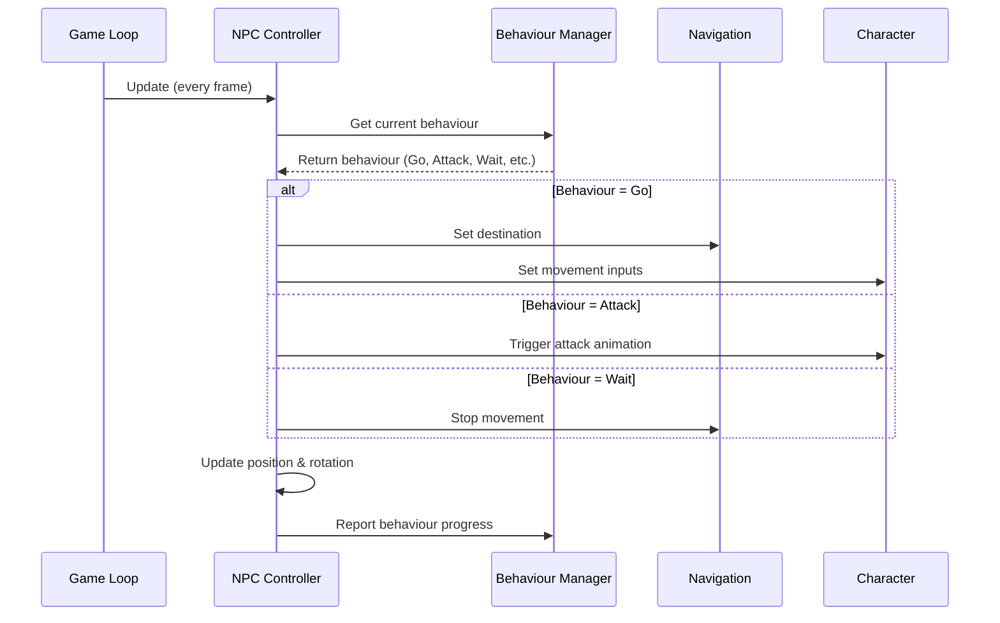

# Chapter 2: NPC Controller

## Connecting Decisions to Actions

In [Chapter 1: Behaviour System](01_behaviour_system_.md), we learned how to create a smart "to-do list" that helps our NPCs decide what to do. But having a plan is just the first step! Now we need something that actually carries out those plans in the game world.

Think about it like this: your brain decides to walk to the kitchen, but it's your legs, arms, and eyes that make it happen. The NPC Controller works the same way - it's the body that executes what the AI brain decides to do.

## What is the NPC Controller?

The NPC Controller is like the central nervous system for our AI characters. It:

- Controls the character's movement and rotation
- Handles navigation around obstacles
- Executes actions like attacking or waiting
- Manages what the character can see and interact with
- Connects the AI's decisions to actual gameplay actions

Let's imagine a simple guard NPC in a game. The Behaviour System might decide "patrol between points A and B" - but it's the NPC Controller that actually moves the character, navigates around obstacles, and makes sure the animation looks right.

## Key Components of the NPC Controller

### 1. Navigation Component

This handles how NPCs move around the game world:

```csharp
public NavMeshAgent agent;

public bool SetNavigationTarget(Vector3 position)
{
    if (agent == null || !agent.enabled || !agent.isOnNavMesh)
    {
        return false;
    }

    return agent.SetDestination(position);
}
```

This code configures the Unity NavMeshAgent (a built-in Unity component for AI navigation) and provides a method to set a destination. The NavMeshAgent automatically finds a path around obstacles, much like GPS navigation in your car.

### 2. Character Control

The NPC Controller connects to the character model to control movement and animations:

```csharp
void FollowAgent()
{
    if (agent == null) return;
    
    // Get direction to next position
    Vector3 nextPosition = agent.nextPosition;
    Vector3 direction = nextPosition - transform.position;
    
    // Convert to character control inputs
    float angle = Vector3.SignedAngle(transform.forward, direction, Vector3.up);
    float xAxis = Mathf.Sin(angle * Mathf.Deg2Rad);
    float yAxis = Vector3.Dot(transform.forward, direction) 
                 * Mathf.Clamp01(direction.magnitude);
    
    // Apply inputs to character
    ((UniCharacter)character.uniComponent.unityComponent).SetInput(xAxis, yAxis);
}
```

This code takes the navigation path and converts it into control inputs for the character. It's like translating "go forward and turn right" into actual joystick movements.

### 3. Target Management

NPCs need to keep track of interesting objects in the world:

```csharp
public void AddTargetObject(AssemblyInstance target)
{
    if (!targets.Contains(target.uniObject.data))
    {
        targets.Add(target.uniObject.data);
    }
}

public UniObjectData GetRandomTarget()
{
    if (targets.Count > 0)
    {
        float minDistance = float.MaxValue;
        UniObjectData target = null;
        
        for (int i = 0; i < targets.Count; i++)
        {
            // Find the closest target
            float distance = Vector3.Distance(
                targets[i].uniObject.transform.position, 
                transform.position
            );
            
            if (distance < minDistance)
            {
                minDistance = distance;
                target = targets[i];
            }
        }
        return target;
    }
    return null;
}
```

This code manages a list of potential targets and provides a method to find the closest one. It's like keeping a mental list of things the NPC should pay attention to.

### 4. Behaviour Execution

When the [Behaviour System](01_behaviour_system_.md) decides on an action, the controller executes it:

```csharp
private void Manager_OnBehaviourChangedEvent(Behaviour behaviour)
{
    if (behaviour == null) return;
    
    lastBehaviour = behaviour;
    
    switch (behaviour.type)
    {
        case BehaviourType.Escape:
            StartNavigation();
            SetNavigationTarget((Vector3)behaviour.data);
            break;
            
        case BehaviourType.Go:
            StartNavigation();
            break;
            
        case BehaviourType.Wait:
            StopNavigation();
            break;
            
        case BehaviourType.LookAt:
            StopNavigation();
            break;
    }
}
```

This code responds to behaviour changes by starting or stopping navigation and setting appropriate targets. It translates abstract behaviours like "escape" into concrete actions like "run toward this specific point."

## How the NPC Controller Works

Let's see how all these pieces work together:



This diagram shows the flow:
1. Every frame, the game calls the NPC Controller's update
2. The controller asks the Behaviour Manager what to do
3. Based on the behaviour, it sets navigation targets or controls animations
4. Finally, it updates the character's position and reports back to the Behaviour Manager

## Practical Example: Creating a Patrolling Guard

Let's put everything together to create a guard that patrols between two points:

```csharp
void CreatePatrollingGuard()
{
    // Create the NPC GameObject
    GameObject guardObject = new GameObject("Guard");
    
    // Add the NPC Controller
    NpcController controller = guardObject.AddComponent<NpcController>();
    controller.useNavigation = true;
    
    // Initialize the controller (assumes we have set up the required components)
    controller.Init(npcInstance, characterInstance);
    
    // Set up patrol points
    Vector3 pointA = new Vector3(10, 0, 0);
    Vector3 pointB = new Vector3(-10, 0, 0);
    
    // Create patrol task
    BehaviourManager manager = new BehaviourManager(controller);
    Task patrolTask = manager.AddTask(1.0f);
    
    // Add patrol behaviours
    patrolTask.AddBehaviour(new Behaviour(BehaviourType.Go, 10, TargetType.Point, pointA));
    patrolTask.AddBehaviour(new Behaviour(BehaviourType.Wait, 3));
    patrolTask.AddBehaviour(new Behaviour(BehaviourType.Go, 10, TargetType.Point, pointB));
    patrolTask.AddBehaviour(new Behaviour(BehaviourType.Wait, 3));
}
```

This code creates a guard that will:
1. Go to point A
2. Wait for 3 seconds (like a guard checking the area)
3. Go to point B
4. Wait for 3 seconds again
5. Repeat the pattern

The NPC Controller handles all the details of finding paths between the points, moving the character along those paths, and making the character wait appropriately.

## Connecting with the Target System

NPCs need to know what's around them. The NPC Controller works with the [Target System](05_target_system_.md) to find and track interesting objects:

```csharp
// Automatically find targets with a specific tag
public void AssignTargetsAutomatically(string tag)
{
    targets.Clear();
    
    // Find the scene data
    SceneData sceneData = npc.uniObject.data?.packObject?.sceneData;
    if (sceneData == null) {
        sceneData = npc.uniObject.data?.sceneData;
        if (sceneData == null) return;
    }
    
    // Find all objects with the specified tag
    targets = sceneData.FindUniObjectsByTag(tag, true);
}
```

This method automatically finds all game objects with a specific tag (like "Player" or "Collectible") and adds them to the NPC's target list. The NPC can then interact with these objects based on its behaviours.

## Connecting with the Navigation System

For complex movement, the NPC Controller works with the [Navigation System](06_navigation_system_.md):

```csharp
// Find a random position the NPC can navigate to
public (bool, Vector3) GetRandomPosition()
{
    float radius = 50;
    Vector3 randomDirection = Random.insideUnitSphere * radius;
    randomDirection += transform.position;
    
    if (NavMesh.SamplePosition(randomDirection, out NavMeshHit hit, radius, 1))
    {
        return (true, hit.position);
    }
    return (false, Vector3.zero);
}
```

This method finds a random position that the NPC can navigate to. It's useful for behaviours like wandering or escaping, where the NPC needs to find a valid destination.

## Common Challenges and Solutions

### Challenge: NPC Gets Stuck on Obstacles

If your NPC gets stuck:

```csharp
public void RealculatePath()
{
    if (agent != null)
    {
        agent.CalculatePath(agent.nextPosition, agent.path);
    }
}
```

This forces the navigation system to recalculate the path, which can help when the NPC is stuck or when the environment has changed.

### Challenge: NPCs All Look Identical

To make NPCs more unique:

```csharp
private void ChangeRandomWeapon()
{
    if (Time.time < nextWeaponChange) return;
    
    nextWeaponChange = Time.time + Random.Range(8, 30);
    npc.CallMethod("SelectRandomAccessory", false, new UniData[] { }, -1, null);
}
```

This method randomly changes the NPC's weapon or accessories, giving each NPC a more unique appearance.

## Best Practices for Using the NPC Controller

1. **Separate Movement from Decision-Making**: Let the [Behaviour System](01_behaviour_system_.md) decide what to do, and the NPC Controller handle how to do it.

2. **Use Unity's NavMesh System**: For complex environments, the built-in NavMesh provides powerful pathfinding capabilities.

3. **Update Target Positions Regularly**: For moving targets, update the navigation destination frequently to ensure the NPC follows properly.

4. **Configure Agent Dimensions Correctly**: Set appropriate radius and height values to prevent NPCs from walking through walls or other NPCs.

5. **Implement Fallbacks**: Always have a backup plan for when navigation fails or targets become unreachable.

## Conclusion

The NPC Controller is the critical link between AI decision-making and in-game action. It translates abstract behaviours from the [Behaviour System](01_behaviour_system_.md) into concrete movement and animations, bringing our AI characters to life in the game world.

By understanding how to configure and use the NPC Controller, you can create NPCs that move naturally through your game environment, find paths around obstacles, interact with targets, and execute a wide range of behaviours.

In the next chapter, [NPC Personality System](03_npc_personality_system_.md), we'll learn how to give our NPCs unique personalities, making them even more engaging and realistic for players.

---

Generated by [AI Codebase Knowledge Builder](https://github.com/The-Pocket/Tutorial-Codebase-Knowledge)