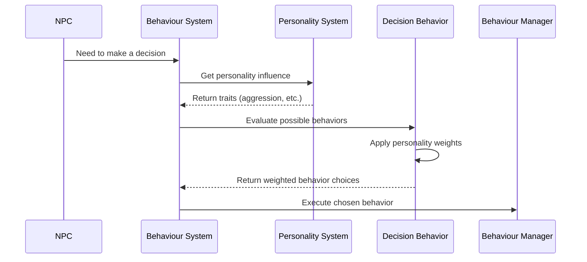

# Chapter 3: NPC Personality System

## Giving Your NPCs Character and Uniqueness

In [Chapter 2: NPC Controller](02_npc_controller_.md), we learned how to connect AI decisions to actions in the game world. But so far, all our NPCs would behave exactly the same way in similar situations. Real characters in games should have unique personalities - some might be aggressive while others are cautious, some might be intelligent while others act more randomly.

Imagine a game with two guard NPCs. If they both spot the player, should they both react exactly the same way? What if one guard is a seasoned veteran who carefully approaches, while the other is an aggressive hothead who charges in immediately? Creating these differences is where the **NPC Personality System** comes in!

## What is the NPC Personality System?

The NPC Personality System is like creating a psychological profile for each AI character. Just as people have different personalities in real life, this system gives NPCs their own unique traits and tendencies that influence their decision-making.

Think of it like adjusting sliders on a character's personality traits:
- **How aggressive are they?** (Will they attack on sight or only when threatened?)
- **How intelligent are they?** (Do they make smart decisions or simple ones?)
- **How random are they?** (Do they behave predictably or surprise the player?)
- **How quickly do they learn?** (Do they adapt to the player's tactics?)

By setting these personality traits, you can create a wide variety of characters that behave uniquely, making your game world feel more alive and realistic.

## Key Personality Traits

Let's look at the core personality traits available in the system:

### 1. Aggressiveness

This trait determines how likely an NPC is to choose aggressive actions like attacking:

```csharp
// Setting a guard to be highly aggressive (80% aggressive)
npcSettings.baseAggresiveness.Data.f = 80f;

// Setting a friendly villager to be barely aggressive (10% aggressive)
npcSettings.baseAggresiveness.Data.f = 10f;
```

Higher aggressiveness means the NPC is more likely to:
- Choose attack behaviors over other options
- Engage enemies from further away
- Be less likely to flee when damaged

### 2. Intelligence

This trait affects how "smart" an NPC appears to be:

```csharp
// Setting a wizard NPC to be highly intelligent (90% intelligence)
npcSettings.baseIntelligence.Data.f = 90f;

// Setting a zombie to have low intelligence (20% intelligence)
npcSettings.baseIntelligence.Data.f = 20f;
```

Intelligence affects:
- The complexity of tasks the NPC can remember and execute
- How well they navigate around obstacles
- Whether they can recognize patterns in player behavior
- How many options they consider before making decisions

### 3. Randomness

This determines how predictable or chaotic an NPC's behavior will be:

```csharp
// Setting a disciplined soldier to be very predictable (20% randomness)
npcSettings.baseRandomness.Data.f = 20f;

// Setting a wild animal to be highly unpredictable (85% randomness)
npcSettings.baseRandomness.Data.f = 85f;
```

Higher randomness means:
- The NPC will sometimes make unexpected choices
- The same situation might result in different reactions
- Players find it harder to predict what the NPC will do next

### 4. Learning Skills

This represents how well an NPC adapts to new situations:

```csharp
// Setting an adaptive AI boss to learn quickly (75% learning)
npcSettings.baseLearningSkills.Data.f = 75f;

// Setting a simple enemy to barely learn (15% learning)
npcSettings.baseLearningSkills.Data.f = 15f;
```

Learning affects:
- How quickly the NPC adapts to player strategies
- Whether they remember past encounters
- If they change tactics when previous approaches fail

## Behavior Permissions

Beyond personality traits, we can also set specific behavior permissions - actions the NPC is allowed to take:

```csharp
// Set a companion NPC's permissions
npcSettings.follow.Data.b = true;       // Can follow the player
npcSettings.attack.Data.b = true;       // Can attack enemies
npcSettings.protect.Data.b = true;      // Will defend allies
npcSettings.useWeapon.Data.b = true;    // Can use weapons
npcSettings.selfDefend.Data.b = true;   // Will defend itself
```

These boolean (true/false) settings act like "on/off switches" for specific behaviors. You can use them to create NPCs with specialized roles by enabling or disabling certain actions.

## NPC Types and Moods

The system also includes pre-defined NPC types and moods to make creating common character archetypes easier:

```csharp
// Create a hostile enemy NPC
npcSettings.npcType = NPCType.Enemy;
npcSettings.mood = Mood.Aggressive;

// Create a helpful companion NPC
npcSettings.npcType = NPCType.Companion;
npcSettings.mood = Mood.Friendly;

// Create a neutral townsperson
npcSettings.npcType = NPCType.UnBiased;
npcSettings.mood = Mood.Natural;
```

These presets help you quickly define common NPC types without having to manually set all the individual personality traits.

## Practical Example: Creating Different Guard Types

Let's create two different guard NPCs with distinct personalities:

```csharp
void CreateVeteranGuard()
{
    // Create the NPC GameObject and components
    GameObject guardObject = new GameObject("Veteran Guard");
    NpcController controller = guardObject.AddComponent<NpcController>();
    
    // Get the settings component
    NpcSettings settings = controller.settings;
    
    // Configure veteran guard personality
    settings.baseAggresiveness.Data.f = 50f;     // Moderate aggression
    settings.baseIntelligence.Data.f = 85f;      // Very intelligent
    settings.baseRandomness.Data.f = 30f;        // Fairly predictable
    settings.baseLearningSkills.Data.f = 70f;    // Learns from experience
    
    // Allow tactical behaviors
    settings.follow.Data.b = true;
    settings.attack.Data.b = true;
    settings.selfDefend.Data.b = true;
    settings.targetInSight.Data.b = true;
    
    controller.ResetSettings();
}
```

This code creates a veteran guard who is intelligent, tactically predictable (not random), and learns from experience. Now let's create a rookie guard:

```csharp
void CreateRookieGuard()
{
    // Create the NPC GameObject and components
    GameObject guardObject = new GameObject("Rookie Guard");
    NpcController controller = guardObject.AddComponent<NpcController>();
    
    // Get the settings component
    NpcSettings settings = controller.settings;
    
    // Configure rookie guard personality
    settings.baseAggresiveness.Data.f = 70f;     // More aggressive
    settings.baseIntelligence.Data.f = 40f;      // Less intelligent
    settings.baseRandomness.Data.f = 75f;        // More unpredictable
    settings.baseLearningSkills.Data.f = 35f;    // Learns slowly
    
    controller.ResetSettings();
}
```

This rookie guard is more aggressive (eager to prove themselves), less intelligent (inexperienced), more random (panicky), and slower to learn new tactics.

## How Personality Affects Behavior Decisions

The personality traits don't just define static values - they actively influence how the [Behaviour System](01_behaviour_system_.md) makes decisions. Let's see how this works under the hood:



This diagram shows how personality traits filter into the decision-making process. When an NPC needs to decide what to do next, its personality traits influence which behaviors are more likely to be chosen.

## The Influence of Aggressiveness

Let's look at a specific example of how the aggressiveness trait affects behavior choice:

```csharp
private void Database_NewTrigger(BehaviourType type)
{
    // Only trigger behaviors based on randomness trait
    if (Random.Range(0, 100) > settings.GetCurrentRandomness())
    {
        return; // Skip behavior if randomness check fails
    }

    switch (type)
    {
        case BehaviourType.Attack:
            // Only proceed if not already attacking
            if (manager.task?.behaviour?.type == type)
            {
                return;
            }
            
            // Higher priority task (5) means it overrides other behaviors
            Task task = manager.AddTask(5);
            UniObjectData target = GetRandomTarget();
            
            if (target != null)
            {
                // If aggressive, directly attack target
                // If not aggressive, approach first then decide
                if (settings.GetCurrentAggresiveness() > 70)
                {
                    // Aggressive: Skip approach, directly attack
                    task.AddBehaviour(new Behaviour(
                        BehaviourType.Attack, 
                        Random.Range(1, 3),
                        TargetType.Character, 
                        target));
                }
                else
                {
                    // Less aggressive: Approach first
                    task.AddBehaviour(new Behaviour(
                        BehaviourType.Go, 
                        Random.Range(2, 6), 
                        TargetType.Character, 
                        target));
                    task.AddBehaviour(new Behaviour(
                        BehaviourType.Attack, 
                        Random.Range(1, 2), 
                        TargetType.Character, 
                        target));
                }
            }
            break;
    }
}
```

In this example:

1. The randomness trait determines if the NPC even considers this behavior
2. The aggressiveness trait then determines HOW the NPC attacks:
   - Highly aggressive NPCs (>70) directly attack
   - Less aggressive NPCs approach cautiously first, then attack

## The Influence of Intelligence

Intelligence affects how many tasks an NPC can remember and prioritize:

```csharp
// Limit task memory based on intelligence
int maxMemory = Mathf.FloorToInt(settings.GetCurrentIntelligence() / 20);
while (manager.tasks.Count > maxMemory)
{
    // Remove least important tasks if we exceed memory capacity
    manager.tasks.RemoveAt(manager.tasks.Count - 1);
}
```

Higher intelligence means the NPC can:
- Remember more tasks (higher `maxMemory`)
- Prioritize between more options
- Make more complex decisions

A low-intelligence NPC might forget what it was doing if something new catches its attention, while a high-intelligence NPC can balance multiple goals effectively.

## How to Modify Personality at Runtime

NPCs don't have to keep the same personality throughout the game. You can modify their traits in response to events:

```csharp
// Make an NPC more aggressive when injured
public void OnTakeDamage(float damageAmount)
{
    // Increase aggressiveness when hurt (cornered animal becomes dangerous)
    float currentHealth = GetHealth();
    if (currentHealth < 0.5f) // Below half health
    {
        // Temporarily boost aggression
        npcSettings.aggresiveness += 20f;
        
        // Schedule a return to normal after some time
        StartCoroutine(RestoreNormalAggression(10f)); // After 10 seconds
    }
}

private IEnumerator RestoreNormalAggression(float delay)
{
    yield return new WaitForSeconds(delay);
    // Return to base aggression level
    npcSettings.aggresiveness = 0f;
}
```

This code makes an NPC more aggressive when injured, creating a "cornered animal" effect, then returns to normal after some time.

## Connecting Personality with Other Systems

The NPC Personality System interacts with several other systems:

### Connection to the [Behaviour System](01_behaviour_system_.md)

Personality traits directly influence which behaviors are chosen and how they're executed:

```csharp
// When creating behaviors, check personality traits
if (settings.GetCurrentAggresiveness() > 50 && settings.attack.Data.b)
{
    // High aggression + allowed to attack = create attack behavior
    manager.AddTask(2).AddBehaviour(new Behaviour(
        BehaviourType.Attack, 
        3, 
        TargetType.Character, 
        target
    ));
}
else if (settings.follow.Data.b)
{
    // Lower aggression = follow behavior instead
    manager.AddTask(1).AddBehaviour(new Behaviour(
        BehaviourType.Follow, 
        5, 
        TargetType.Character, 
        target
    ));
}
```

### Connection to the [Target System](05_target_system_.md)

Personality affects how NPCs choose and prioritize targets:

```csharp
// Choosing which target to focus on
public UniObjectData SelectBestTarget(List<UniObjectData> possibleTargets)
{
    if (possibleTargets.Count == 0) return null;
    
    // More aggressive NPCs prioritize closer targets they can attack
    if (settings.GetCurrentAggresiveness() > 70)
    {
        // Find closest target
        return FindClosestTarget(possibleTargets);
    }
    // More intelligent NPCs might prioritize weakest targets
    else if (settings.GetCurrentIntelligence() > 70)
    {
        // Find most vulnerable target
        return FindWeakestTarget(possibleTargets);
    }
    // More random NPCs might choose unpredictably
    else if (settings.GetCurrentRandomness() > 70)
    {
        // Pick a random target
        int randomIndex = Random.Range(0, possibleTargets.Count);
        return possibleTargets[randomIndex];
    }
    
    // Default to closest target
    return FindClosestTarget(possibleTargets);
}
```

## Creating Mood Presets

To make NPC creation easier, you can create preset personalities for common character types:

```csharp
// Apply a preset mood to an NPC
public void ApplyMoodPreset(NpcSettings settings, Mood mood)
{
    switch (mood)
    {
        case Mood.Friendly:
            settings.baseAggresiveness.Data.f = 20f;
            settings.baseRandomness.Data.f = 40f;
            settings.follow.Data.b = true;
            settings.attack.Data.b = false;
            break;
            
        case Mood.Aggressive:
            settings.baseAggresiveness.Data.f = 85f;
            settings.baseRandomness.Data.f = 50f;
            settings.attack.Data.b = true;
            settings.selfDefend.Data.b = true;
            break;
            
        case Mood.Coward:
            settings.baseAggresiveness.Data.f = 10f;
            settings.baseRandomness.Data.f = 70f;
            settings.attack.Data.b = false;
            settings.selfDefend.Data.b = false;
            break;
            
        // Other moods...
    }
}
```

This function lets you quickly apply common personality types to NPCs without setting each trait individually.

## Best Practices for Using the NPC Personality System

1. **Start with Presets**: Use the built-in NPC types and moods as starting points, then customize as needed.

2. **Test Extreme Values**: Try setting traits to very high or low values to see how they affect behavior.

3. **Combination Effects**: Remember that traits interact with each other - high aggression but low intelligence creates a different character than high aggression with high intelligence.

4. **Dynamic Adjustments**: Consider changing personality traits during gameplay based on events for more realistic character development.

5. **Subtle Differences**: Even small variations in personality traits can make NPCs feel different - you don't need extreme differences for NPCs to feel unique.

## Conclusion

The NPC Personality System transforms your AI characters from predictable robots into entities with unique behaviors and reactions. By adjusting traits like aggressiveness, intelligence, and randomness, you can create a wide range of character types that make your game world feel more alive and dynamic.

This system works hand-in-hand with the [Behaviour System](01_behaviour_system_.md) and [NPC Controller](02_npc_controller_.md) we've already learned about, adding an extra layer of depth to your AI. Rather than explicitly programming every reaction, you can define personality traits and let the AI system naturally generate appropriate behaviors based on those traits.

In the next chapter, [Factor Monitoring System](04_factor_monitoring_system_.md), we'll learn how to track and respond to important factors in the game world, allowing our NPCs to react appropriately to changes in their environment and situation.

---

Generated by [AI Codebase Knowledge Builder](https://github.com/The-Pocket/Tutorial-Codebase-Knowledge)