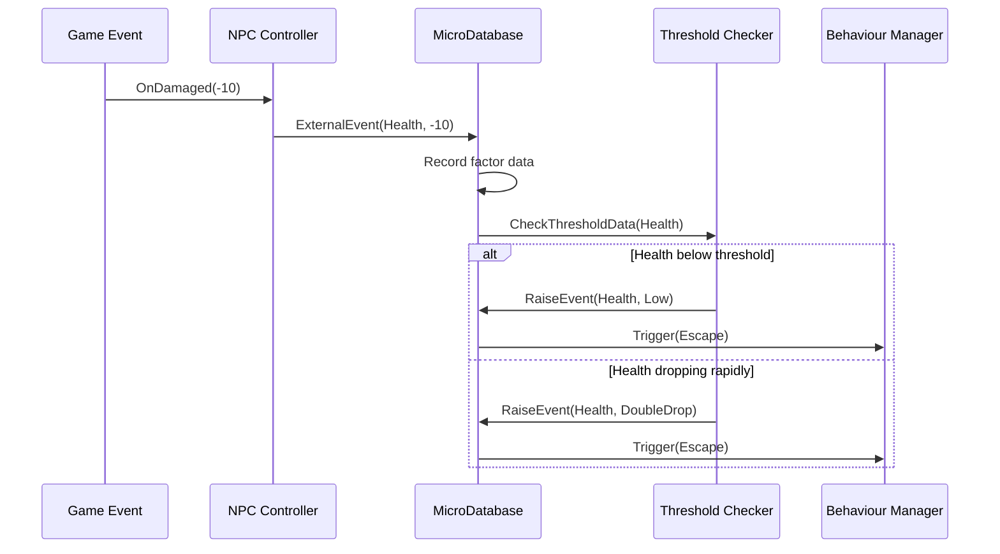

# Chapter 4: Factor Monitoring System

In [Chapter 3: NPC Personality System](03_npc_personality_system_.md), we learned how to give our NPCs unique personalities that influence their decision-making. But even the most well-defined personality needs to respond to changing conditions. Just as you might change your behavior when you're hungry or tired, our NPCs need to react to their changing state - and that's where the Factor Monitoring System comes in.

## Introducing the Factor Monitoring System

Imagine you're playing a game with an enemy soldier NPC. When the NPC is at full health, they might aggressively attack you. But what should happen when their health drops low? Or when they run out of ammunition? A realistic character would change their behavior - perhaps retreating to find health or taking cover to reload.

The **Factor Monitoring System** acts like the NPC's senses and survival instincts. It constantly monitors important statistics (factors) and triggers appropriate behaviors when certain conditions are met. It's similar to how your body knows when you're thirsty, hungry, or tired, and urges you to drink, eat, or rest.

## Key Components of the Factor Monitoring System

Let's break down the main elements of this system:

### 1. Factors: The Important Statistics

**Factors** are the vital statistics that an NPC needs to monitor:

```csharp
public enum Factor
{
    Health,    // Physical wellbeing
    Stamina,   // Energy for actions
    Strength,  // Physical power
    Power,     // Special abilities energy
    Ammo,      // Ammunition remaining
    Hit        // When taking damage
}
```

Each factor represents something important to the NPC's functioning and survival. Just as you might monitor your phone's battery level or your car's fuel gauge, NPCs monitor these factors to make good decisions.

### 2. Events: The Significant Changes

The system detects different types of **events** that can happen to each factor:

```csharp
public enum EventType
{
    Low,        // Factor is below minimum threshold
    High,       // Factor is above maximum threshold
    Drop,       // Factor is decreasing significantly
    Raise,      // Factor is increasing significantly
    DoubleDrop, // Factor is decreasing very rapidly
    DoubleRise  // Factor is increasing very rapidly
}
```

These events represent significant changes or states that the NPC should respond to. For example, "Health-Low" means health has fallen below a critical threshold, while "Ammo-Drop" means ammunition is being used up quickly.

### 3. Thresholds: The Trigger Points

For each factor, we define **thresholds** that determine when events are triggered:

```csharp
// Threshold storage (Factor, min, max)
public Dictionary<Factor, (float, float)> thresholds = new()
{
    {Factor.Health, (0.5f, 0.8f) },
    {Factor.Stamina, (0.4f, 0.7f) },
    {Factor.Strength, (0.3f, 0.6f) },
    {Factor.Power, (0.4f, 0.7f) },
    {Factor.Ammo, (3, 10) }
};
```

In this example, Health below 50% triggers a "Low" event, while Health above 80% is considered "High". These thresholds act like warning lights on your car's dashboard - they alert the NPC when something needs attention.

### 4. Event-Behavior Connections: The Response Plan

Finally, we connect specific events to appropriate behaviors:

```csharp
public Dictionary<(Factor, EventType), BehaviourType> events = new()
{
    { (Factor.Health, EventType.Drop), BehaviourType.Attack },
    { (Factor.Health, EventType.DoubleDrop), BehaviourType.Escape },
    { (Factor.Health, EventType.Low), BehaviourType.Escape },
    { (Factor.Stamina, EventType.Low), BehaviourType.Escape },
    { (Factor.Ammo, EventType.Low), BehaviourType.Escape },
    // More connections...
};
```

This dictionary maps factor events to appropriate behaviors. For example, when health drops very quickly (DoubleDrop), the NPC will try to escape. When ammunition is low, the NPC will also try to escape. These connections ensure the NPC responds appropriately to changing conditions.

## How to Use the Factor Monitoring System

Let's implement a simple enemy NPC that responds to changing health and ammunition:

### Step 1: Set Up the Factor Monitoring System

First, we need to initialize the system for our NPC:

```csharp
// Create the NPC controller
NpcController enemyController = GetComponent<NpcController>();

// Initialize the Factor Monitoring System
// (This happens automatically when the NpcController is initialized)
enemyController.Init(npcInstance, characterInstance);

// The database within the controller now monitors factors
MicroDatabase database = enemyController.database;
```

The NpcController automatically sets up a MicroDatabase that will monitor the NPC's factors. The database will track changes and trigger appropriate behaviors when thresholds are crossed.

### Step 2: Trigger Events When Factors Change

Next, we need to inform the system when factors change:

```csharp
// When the NPC takes damage
public void OnDamaged(float damageAmount)
{
    // Create a data value representing the damage
    UniData damageData = new UniData(-damageAmount);
    
    // Inform the Factor Monitoring System
    enemyController.ExternalEvent((int)Factor.Health, damageData);
    
    // The system will automatically check thresholds and trigger behaviors
}
```

When the NPC takes damage, we tell the Factor Monitoring System that the Health factor has changed. The system will check if this crosses any thresholds and trigger appropriate behaviors.

### Step 3: Adjust for Ammunition Use

Similarly, we can track ammunition usage:

```csharp
// When the NPC fires a weapon
public void OnWeaponFired(int ammoUsed)
{
    // Create a data value representing the ammo used
    UniData ammoData = new UniData(-ammoUsed);
    
    // Inform the Factor Monitoring System
    enemyController.ExternalEvent((int)Factor.Ammo, ammoData);
    
    // System will check if ammo is low and trigger behaviors if needed
}
```

This tells the system that the Ammo factor has decreased. If ammunition drops too low, the system will trigger an escape behavior.

## How the Factor Monitoring System Works Internally

Let's look at what happens inside the system when a factor changes:



This diagram shows:
1. A game event (like taking damage) triggers the process
2. The NPC Controller sends the event to the MicroDatabase
3. The database records the data and checks thresholds
4. If thresholds are crossed, the system raises appropriate events
5. These events trigger behaviors in the Behaviour Manager

Let's look at the key method that checks if thresholds are crossed:

```csharp
void CheckThresholdData(Factor factor)
{
    float changePerMinute = changePerMinData[factor];
    float value = data[factor].Data.f;
    float maxValue = maxData[factor].Data.f;

    // Rapid decrease detection
    if (changePerMinute <= changePerMinThresholds[factor].Item1 * 2 * maxValue)
    {
        RaiseEvent(factor, EventType.DoubleDrop);
    }
    else if (changePerMinute <= changePerMinThresholds[factor].Item1 * maxValue)
    {
        RaiseEvent(factor, EventType.Drop);
    }

    // Low value detection
    if (value <= thresholds[factor].Item1 * maxValue)
    {
        RaiseEvent(factor, EventType.Low);
    }

    // More checks...
}
```

This method examines both the current value and the rate of change for a factor. It can detect not just when a value is low, but also when it's dropping quickly - allowing NPCs to anticipate problems and react proactively.

## Practical Example: A Smart Enemy NPC

Let's see a complete example of an enemy NPC that uses the Factor Monitoring System to behave realistically:

### Setting Up the NPC

```csharp
void CreateSmartEnemy()
{
    // Create and set up the NPC as we've learned
    GameObject enemyObject = new GameObject("Smart Enemy");
    NpcController controller = enemyObject.AddComponent<NpcController>();
    controller.Init(npcInstance, characterInstance);
    
    // Customize factor thresholds for this enemy
    MicroDatabase database = controller.database;
    
    // This enemy will escape at 30% health instead of the default 50%
    database.thresholds[Factor.Health] = (0.3f, 0.8f);
    
    // This enemy will consider 5 bullets low ammo instead of default 3
    database.thresholds[Factor.Ammo] = (5, 15);
}
```

Here we're creating an enemy NPC and customizing its factor thresholds. This particular enemy will fight until its health drops to 30% (more aggressive than the default 50%), and it considers 5 bullets to be low ammunition.

### Reacting to Factor Changes

With the Factor Monitoring System set up, the NPC will automatically react to changing conditions:

1. **When health is high (>80%)**: The NPC aggressively attacks
2. **When health drops below 30%**: The "Health-Low" event triggers an escape behavior
3. **When health drops very rapidly**: The "Health-DoubleDrop" event also triggers an escape behavior
4. **When ammo drops below 5 bullets**: The "Ammo-Low" event triggers an escape behavior

The NPC will make these decisions automatically based on the Factor Monitoring System, without requiring explicit code for each situation.

## Integration with Other Systems

The Factor Monitoring System works closely with other AI systems:

### Connection to the [Behaviour System](01_behaviour_system_.md)

When the Factor Monitoring System detects important events, it creates appropriate behaviors:

```csharp
private void Database_NewTrigger(BehaviourType type)
{
    // Various checks and randomness...
    
    switch (type)
    {
        case BehaviourType.Escape:
            if (manager.task?.behaviour?.type == type)
            {
                return; // Already escaping
            }
            
            // Find a safe position to escape to
            (bool isOk, Vector3 position) = GetRandomPosition();
            
            if (isOk)
            {
                // Create a high-priority escape task (priority 3)
                manager.AddTask(3).AddBehaviour(new Behaviour(
                    BehaviourType.Escape, 
                    Random.Range(2, 6), 
                    TargetType.Point, 
                    position
                ));
            }
            break;
            
        // Other behavior types...
    }
}
```

This method is called when the Factor Monitoring System triggers a behavior. It creates appropriate tasks in the [Behaviour System](01_behaviour_system_.md), which then executes them through the [NPC Controller](02_npc_controller_.md).

### Connection to the [NPC Personality System](03_npc_personality_system_.md)

Factor changes can also influence an NPC's personality:

```csharp
void RaiseEvent(Factor factor, EventType eventType)
{
    // Trigger appropriate behavior...
    
    // If health is dropping, increase aggressiveness
    if (factor == Factor.Health && eventType == EventType.Drop)
    {
        float changePerMinute = changePerMinData[factor];
        settings.aggresiveness += changePerMinute;
        Debug.Log("Aggresiveness: " + settings.GetCurrentAggresiveness());
    }
}
```

This creates a "cornered animal" effect - as the NPC loses health, it becomes more aggressive, reflecting how real creatures often fight harder when wounded.

## Creating Custom Factor Reactions

You can customize how NPCs react to factor changes by modifying the events dictionary:

```csharp
// Create a cautious NPC that takes cover when ammo is low
void CreateCautiousNPC()
{
    // Setup NPC...
    
    // Modify factor reactions
    MicroDatabase database = controller.database;
    
    // When ammo is low, take cover instead of escaping
    database.events[(Factor.Ammo, EventType.Low)] = BehaviourType.TakeCover;
    
    // When health is low but not critical, heal instead of escaping
    database.events[(Factor.Health, EventType.Low)] = BehaviourType.UseHealthItem;
    
    // Only escape on critical health
    database.events[(Factor.Health, EventType.DoubleDrop)] = BehaviourType.Escape;
}
```

This customizes how the NPC responds to different factor events, creating a more nuanced behavior pattern.

## Best Practices for Using the Factor Monitoring System

1. **Adjust Thresholds Based on Difficulty**: For easier enemies, set health thresholds higher so they retreat sooner. For harder enemies, set them lower so they fight longer.

2. **Consider Multiple Factors**: Don't just monitor health - use stamina, ammo, and other factors to create more realistic NPCs that respond to many conditions.

3. **Customize for Different NPC Types**: A soldier might prioritize ammo, while a monster might care more about health. Adjust thresholds and reactions accordingly.

4. **Add Randomness**: Combine the Factor Monitoring System with the [NPC Personality System](03_npc_personality_system_.md) randomness trait to create less predictable reactions.

5. **Use Rate of Change**: Don't just respond to absolute values - use the rate of change (Drop/Raise events) to create proactive NPCs that anticipate problems.

## Conclusion

The Factor Monitoring System creates realistic, dynamic NPCs by connecting their internal state to appropriate behaviors. Just as real creatures adapt their behavior based on hunger, injury, or fatigue, our NPCs can now respond intelligently to changing conditions in the game world.

This system works hand-in-hand with the [Behaviour System](01_behaviour_system_.md), [NPC Controller](02_npc_controller_.md), and [NPC Personality System](03_npc_personality_system_.md) to create NPCs that seem alive and responsive. By monitoring important factors and triggering appropriate reactions, we create characters that players will find both challenging and believable.

In the next chapter, [Target System](05_target_system_.md), we'll learn how NPCs identify and evaluate potential targets in the game world, allowing them to make informed decisions about who to attack, follow, or avoid.

---

Generated by [AI Codebase Knowledge Builder](https://github.com/The-Pocket/Tutorial-Codebase-Knowledge)