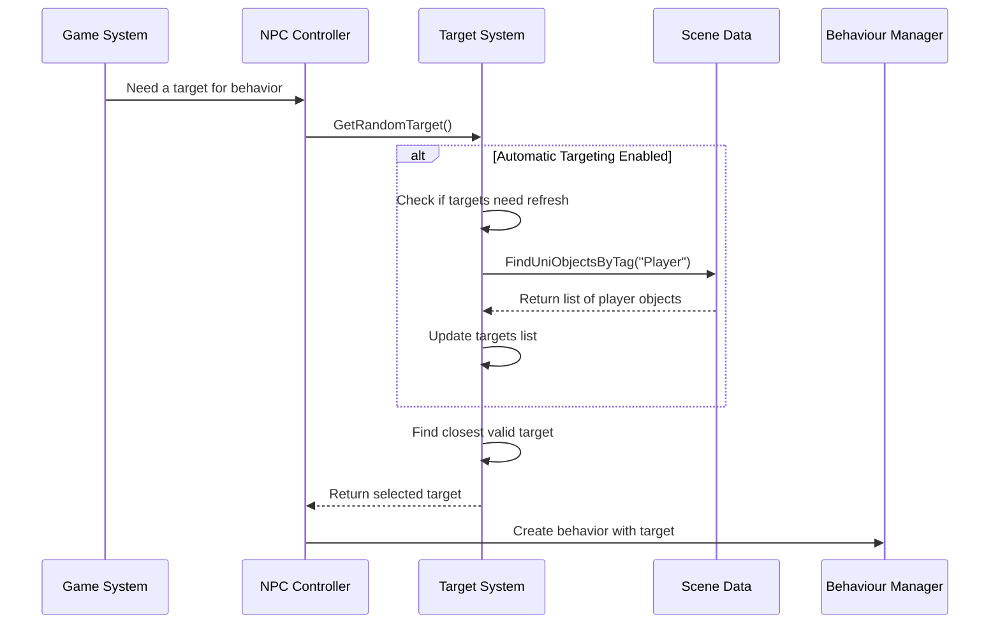

# Chapter 5: Target System

In [Chapter 4: Factor Monitoring System](04_factor_monitoring_system_.md), we learned how NPCs can monitor their internal state and respond to changes in factors like health and ammunition. But for many behaviors, NPCs also need to be aware of the external world - particularly other characters and objects they might want to interact with. That's where the **Target System** comes in.

## What is the Target System?

Imagine you're playing a game where enemy soldiers need to find and attack you. How do they know where you are? How do they keep track of you when you move? How do they decide whether to focus on you or another threat?

The **Target System** works like a radar for NPCs - it helps them find, identify, and track objects of interest in the game world. Just as a security guard might scan their surroundings for suspicious activity, our NPCs need to constantly evaluate potential targets in their environment.

With the Target System, NPCs can:
- Automatically find objects with specific tags (like "Player" or "Enemy")
- Manually be assigned specific targets to track
- Keep track of multiple potential targets at once
- Choose the most relevant target based on distance, threat level, or other criteria
- Focus their behaviors (attacking, following, etc.) on appropriate targets

## Key Components of the Target System

Let's break down the main elements of the Target System:

### 1. Target Identification

First, our NPCs need a way to find potential targets in the game world:

```csharp
// Automatically find targets with a specific tag
public void AssignTargetsAutomatically(string tag)
{
    // Clear the current target list
    targets.Clear();
    
    // Find all game objects with the specified tag
    SceneData sceneData = npc.uniObject.data?.packObject?.sceneData;
    if (sceneData != null)
    {
        targets = sceneData.FindUniObjectsByTag(tag, true);
    }
}
```

This code searches the entire game scene for objects with a specific tag and adds them to the NPC's target list. It's like giving the NPC a pair of binoculars and saying "find everyone wearing a red shirt."

### 2. Target List Management

Once we've found potential targets, we need to keep track of them:

```csharp
// List to store potential targets
List<UniObjectData> targets = new();

// Add a specific target to the list
public void AddTargetObject(AssemblyInstance target)
{
    if (!targets.Contains(target.uniObject.data))
    {
        targets.Add(target.uniObject.data);
    }
}

// Remove a target from the list
public void RemoveTargetObject(AssemblyInstance target)
{
    if (targets.Contains(target.uniObject.data))
    {
        targets.Remove(target.uniObject.data);
    }
}
```

These methods let us add and remove specific targets from the NPC's target list. Think of this like a watchlist - the NPC keeps track of objects it should pay attention to.

### 3. Target Selection

With a list of potential targets, the NPC needs to decide which one to focus on:

```csharp
// Get the closest target from the list
public UniObjectData GetClosestTarget()
{
    if (targets.Count == 0) return null;
    
    float minDistance = float.MaxValue;
    UniObjectData closestTarget = null;
    
    foreach (UniObjectData target in targets)
    {
        if (target == null || target.uniObject == null) continue;
        
        // Calculate distance to this target
        float distance = Vector3.Distance(
            target.uniObject.transform.position, 
            transform.position
        );
        
        // If this is the closest target so far, remember it
        if (distance < minDistance)
        {
            minDistance = distance;
            closestTarget = target;
        }
    }
    
    return closestTarget;
}
```

This method finds the closest target in the list. It's like a guard scanning the room and focusing on the nearest suspicious person first.

## Using the Target System in Practice

Let's see how we can use the Target System to create an enemy that automatically targets players:

### Setting Up Automatic Target Detection

```csharp
void SetupEnemyTargeting()
{
    // Get the NPC Controller component
    NpcController enemyController = GetComponent<NpcController>();
    
    // Enable automatic targeting
    enemyController.npc.GetPropertyByName("automaticTargeting").Data.b = true;
    
    // Set which tag to look for (in this case, "Player")
    enemyController.npc.GetPropertyByName("targetsTag").Data.s = "Player";
    
    // The system will now automatically find and track players
}
```

With this setup, the NPC will automatically find and track any objects tagged as "Player" in the game. It's like telling a security camera to only pay attention to people wearing visitor badges.

### Using Targets with the Behaviour System

Once our NPC has targets, we can use them in behaviors:

```csharp
void CreateAttackBehavior()
{
    // Get the NPC Controller
    NpcController enemyController = GetComponent<NpcController>();
    
    // Get a target (in this case, the closest one)
    UniObjectData target = enemyController.GetRandomTarget();
    
    if (target != null)
    {
        // Create a task to attack this target
        Task attackTask = enemyController.manager.AddTask(2.0f);
        
        // First go to the target
        attackTask.AddBehaviour(new Behaviour(
            BehaviourType.Go, 
            5, 
            TargetType.Character, 
            target
        ));
        
        // Then attack the target
        attackTask.AddBehaviour(new Behaviour(
            BehaviourType.Attack, 
            3, 
            TargetType.Character, 
            target
        ));
    }
}
```

This code creates a behavior sequence where the NPC first moves to the target, then attacks it. The Target System provides the target object, which the [Behaviour System](01_behaviour_system_.md) then uses to create appropriate behaviors.

## How the Target System Works Internally

Let's look at what happens inside the Target System when an NPC needs to find a target:



This diagram shows the flow:
1. The NPC Controller needs a target for a behavior
2. It asks the Target System for a target
3. If automatic targeting is enabled, the system refreshes its target list
4. The system selects an appropriate target (usually the closest one)
5. The NPC Controller uses this target to create a behavior

Now let's look at the key code that makes this happen:

```csharp
public UniObjectData GetRandomTarget()
{
    // If automatic targeting is enabled, refresh the target list
    if (npc.GetPropertyByName("automaticTargeting").Data.b)
    {
        string tag = npc.GetPropertyByName("targetsTag").Data.s;
        AssignTargetsAutomatically(tag);
    }

    // Find the closest target in the list
    if (targets.Count > 0)
    {
        float minDistance = float.MaxValue;
        UniObjectData closestTarget = null;
        
        for (int i = 0; i < targets.Count; i++)
        {
            // Skip invalid targets
            if (targets[i] == null || targets[i].uniObject == null)
            {
                continue;
            }
            
            // Calculate distance to this target
            float distance = Vector3.Distance(
                targets[i].uniObject.transform.position, 
                transform.position
            );
            
            // If this is the closest target so far, remember it
            if (distance < minDistance)
            {
                minDistance = distance;
                closestTarget = targets[i];
            }
        }
        
        return closestTarget;
    }
    
    // No valid targets found
    return null;
}
```

This method is the heart of the Target System. Despite its name (`GetRandomTarget`), it actually returns the closest target, which is usually the most relevant one for NPCs to interact with.

## Using Targets with Other Systems

The Target System is designed to work seamlessly with other AI systems:

### Integration with the [Behaviour System](01_behaviour_system_.md)

The [Behaviour System](01_behaviour_system_.md) uses targets to create meaningful behaviors:

```csharp
private void Database_NewTrigger(BehaviourType type)
{
    // Skip if randomness check fails
    if (Random.Range(0, 100) > settings.GetCurrentRandomness())
    {
        return;
    }

    switch (type)
    {
        case BehaviourType.Attack:
            // Get a target using the Target System
            UniObjectData target = GetRandomTarget();
            
            if (target != null)
            {
                // Create a high-priority attack task
                Task task = manager.AddTask(5);
                
                // First go to the target
                task.AddBehaviour(new Behaviour(
                    BehaviourType.Go, 
                    Random.Range(2, 6), 
                    TargetType.Character, 
                    target
                ));
                
                // Then attack the target
                task.AddBehaviour(new Behaviour(
                    BehaviourType.Attack, 
                    Random.Range(1, 2), 
                    TargetType.Character, 
                    target
                ));
            }
            break;
    }
}
```

This code shows how the Factor Monitoring System can trigger an attack behavior, which then uses the Target System to find a target, and finally creates appropriate behaviors through the Behaviour System.

### Integration with the [Navigation System](06_navigation_system_.md)

The [Navigation System](06_navigation_system_.md) uses targets to determine where the NPC should move:

```csharp
private void UpdateFollowingTarget()
{
    // Only update every 0.2 seconds to save performance
    if (Time.time < nextTargetUpdate)
    {
        return;
    }
    nextTargetUpdate = Time.time + 0.2f;
    
    // Get the current behavior
    Behaviour behaviour = manager?.task?.behaviour;
    
    // If we're going to a character target, update its position
    if (behaviour != null && 
        behaviour.type == BehaviourType.Go && 
        behaviour.targetType == TargetType.Character && 
        behaviour.data != null)
    {
        // Get the target data
        UniObjectData data = (UniObjectData)behaviour.data;
        
        // Update the navigation target to the current position
        if (data != null && data.uniObject != null)
        {
            SetNavigationTarget(data.uniObject.transform.position);
        }
    }
}
```

This method updates the NPC's navigation destination when following a moving target. It's called regularly to ensure the NPC follows the target even as it moves.

## Practical Example: Creating a Guard That Detects Intruders

Let's put everything together to create a guard NPC that patrols normally but attacks when it detects intruders:

```csharp
void CreatePatrollingGuard()
{
    // Create the guard GameObject
    GameObject guardObject = new GameObject("Guard");
    
    // Add and set up the NPC Controller
    NpcController controller = guardObject.AddComponent<NpcController>();
    controller.Init(npcInstance, characterInstance);
    
    // Enable automatic targeting of players
    controller.npc.GetPropertyByName("automaticTargeting").Data.b = true;
    controller.npc.GetPropertyByName("targetsTag").Data.s = "Player";
    
    // Set up patrol points
    Vector3 pointA = new Vector3(10, 0, 0);
    Vector3 pointB = new Vector3(-10, 0, 0);
    
    // Create patrol task (lower priority)
    Task patrolTask = controller.manager.AddTask(1.0f);
    
    // Add patrol behaviors
    patrolTask.AddBehaviour(new Behaviour(
        BehaviourType.Go, 10, TargetType.Point, pointA));
    patrolTask.AddBehaviour(new Behaviour(
        BehaviourType.Wait, 3));
    patrolTask.AddBehaviour(new Behaviour(
        BehaviourType.Go, 10, TargetType.Point, pointB));
    patrolTask.AddBehaviour(new Behaviour(
        BehaviourType.Wait, 3));
}
```

This code creates a guard that patrols between two points. Thanks to the automatic targeting, the guard will detect players tagged as "Player" and can react to them (for example, with the attack behavior we saw earlier).

## Advanced Target Selection

While the closest target is often the most relevant, sometimes we want more sophisticated target selection. Here's an example of how to choose targets based on threat level:

```csharp
public UniObjectData GetHighestThreatTarget()
{
    if (targets.Count == 0) return null;
    
    float highestThreat = 0f;
    UniObjectData mostThreateningTarget = null;
    
    foreach (UniObjectData target in targets)
    {
        if (target == null || target.uniObject == null) continue;
        
        // Calculate threat level (could be based on distance, damage potential, etc.)
        float threatLevel = CalculateThreatLevel(target);
        
        if (threatLevel > highestThreat)
        {
            highestThreat = threatLevel;
            mostThreateningTarget = target;
        }
    }
    
    return mostThreateningTarget;
}

private float CalculateThreatLevel(UniObjectData target)
{
    // Simple threat calculation based on distance and damage potential
    float distance = Vector3.Distance(
        target.uniObject.transform.position, 
        transform.position
    );
    
    // The closer the target, the higher the threat
    float distanceThreat = 100f / (distance + 1f);
    
    // Could add more factors here, like target's weapon power
    
    return distanceThreat;
}
```

This more advanced approach selects targets based on a calculated threat level rather than just distance. You could extend this to consider factors like target health, weapon type, or past behavior.

## Target Visibility and Line of Sight

In many games, NPCs should only target what they can see. Here's a simple line-of-sight check:

```csharp
public bool CanSeeTarget(UniObjectData target)
{
    if (target == null || target.uniObject == null) return false;
    
    // Get the target's position
    Vector3 targetPosition = target.uniObject.transform.position;
    
    // Calculate direction to target
    Vector3 directionToTarget = targetPosition - transform.position;
    float distanceToTarget = directionToTarget.magnitude;
    
    // Check if target is within view angle
    float dotProduct = Vector3.Dot(
        transform.forward, 
        directionToTarget.normalized
    );
    
    // If target is not in front of NPC (within 90 degrees), can't see it
    if (dotProduct < 0.1f) return false;
    
    // Check if there are obstacles blocking the view
    if (Physics.Raycast(
        transform.position, 
        directionToTarget, 
        out RaycastHit hit, 
        distanceToTarget))
    {
        // Something is blocking the view - is it the target?
        if (hit.transform != target.uniObject.transform)
        {
            return false; // Line of sight blocked by obstacle
        }
    }
    
    return true; // Can see the target
}
```

This method checks if the NPC can see a target by verifying:
1. Is the target in front of the NPC? (using a dot product)
2. Is there a clear line of sight to the target? (using a raycast)

You can add this to the target selection process to ensure NPCs only target what they can actually see.

## Best Practices for Using the Target System

1. **Tag Your Objects Appropriately**: Make sure game objects are tagged correctly so NPCs can find them using automatic targeting.

2. **Balance Target Updates**: Updating target positions too frequently can impact performance. The example code updates every 0.2 seconds, which is usually sufficient.

3. **Consider Line of Sight**: In most games, NPCs shouldn't be able to "see through walls." Add visibility checks for more realistic behavior.

4. **Choose Targeting Strategy Carefully**: Different NPCs might need different targeting strategies - soldiers might target the closest threat, while healers might target the most injured ally.

5. **Clear Invalid Targets**: Regularly check for and remove invalid targets (e.g., destroyed objects) from the target list.

## Conclusion

The Target System gives our NPCs the ability to identify, track, and select relevant objects in the game world. It's like giving them eyes and a brain to decide what to focus on. This system is essential for creating NPCs that can interact meaningfully with the game world and with players.

By connecting the Target System with the [Behaviour System](01_behaviour_system_.md), the [NPC Personality System](03_npc_personality_system_.md), and the [Factor Monitoring System](04_factor_monitoring_system_.md), we create NPCs that can make intelligent decisions about which targets to engage and how to interact with them.

In the next chapter, [Navigation System](06_navigation_system_.md), we'll learn how NPCs can plan paths and move through the game world once they've decided where to go.

---

Generated by [AI Codebase Knowledge Builder](https://github.com/The-Pocket/Tutorial-Codebase-Knowledge)