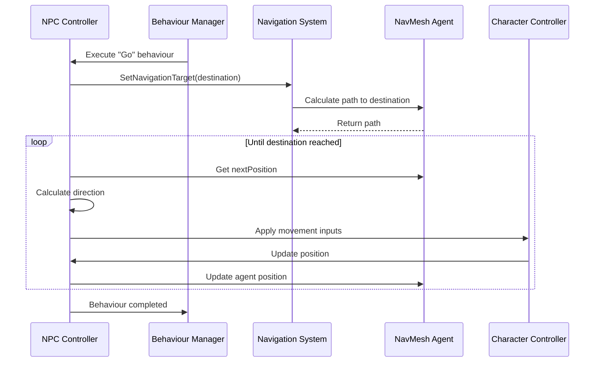

# Chapter 6: Navigation System

In [Chapter 5: Target System](05_target_system_.md), we learned how NPCs identify and track objects of interest in the game world. But once an NPC has decided to move toward a target, how does it actually get there? How does it avoid walls, navigate around furniture, or find the best path in a complex environment? That's what the **Navigation System** handles!

## What is the Navigation System?

Think of the Navigation System as the NPC's "inner GPS." Just like how your phone's navigation app helps you find the best route to a destination, the Navigation System helps NPCs find paths through the game world.

Imagine a guard NPC that needs to chase a player through a castle. Without a Navigation System, the guard would just move in a straight line toward the player - trying to walk through walls, falling off ledges, or getting stuck on furniture. The Navigation System gives the NPC the ability to find a sensible path, just like a real person would.

## Key Components of the Navigation System

Let's break down the Navigation System into its main parts:

### 1. Navigation Mesh (NavMesh)

The Navigation Mesh (or NavMesh) is like a map of all the areas where NPCs can walk:

```csharp
// Example of generating a NavMesh for the current scene
public static NavMeshData GenerateNavMesh(SceneData sceneData, NavMeshBuildSettings buildSettings)
{
    // Create an empty list to store all meshes that will be part of the NavMesh
    List<NavMeshBuildSource> sources = new();
    
    // Default bounds (will be updated as we find objects)
    Bounds bounds = new()
    {
        min = 1000000 * Vector3.one,
        max = -1000000 * Vector3.one
    };

    // Find all objects marked as navmesh objects and add them to sources
    CollectNavmeshData(sceneData.uniObjects, ref sources, ref bounds);
    
    // Create and build the actual NavMesh
    NavMeshData navMeshData = new();
    NavMesh.AddNavMeshData(navMeshData);
    NavMeshBuilder.UpdateNavMeshDataAsync(navMeshData, buildSettings, sources, bounds);
    
    return navMeshData;
}
```

This code is responsible for creating the NavMesh - a special representation of the game world that tells NPCs where they can walk. It's like creating a "walkability map" of your level.

The NavMesh is typically generated from the static geometry in your level (floors, terrain, etc.), while obstacles (like furniture or walls) create "holes" in the mesh that NPCs will navigate around.

### 2. NavMesh Agent

Each NPC that needs to navigate uses a NavMesh Agent - a component that helps it move along the NavMesh:

```csharp
// Setting up a NavMesh Agent for an NPC
void SetupNavigation()
{
    // Add a NavMeshAgent component to the NPC
    agent = gameObject.AddComponent<NavMeshAgent>();
    
    // Configure how the agent updates the character
    agent.updatePosition = false;
    agent.updateRotation = false;
    agent.updateUpAxis = false;
    
    // Update agent dimensions based on character size
    UpdateAgentDimensions();
}

public void UpdateAgentDimensions()
{
    // Enable/disable navigation based on NPC settings
    useNavigation = npc.uniComponent.FindPropertyByName("useNavigation").value.b;
    agent.enabled = useNavigation;
    
    // Set the agent's radius and height
    if (npc.uniComponent.FindPropertyByName("overrideDimensions").value.b)
    {
        agent.radius = npc.uniComponent.FindPropertyByName("radius").value.f;
        agent.height = npc.uniComponent.FindPropertyByName("height").value.f;
    }
    else if (character != null)
    {
        agent.radius = character.uniComponent.FindPropertyByName("radius").value.f;
        agent.height = character.uniComponent.FindPropertyByName("height").value.f;
    }
    
    // Set how close the agent needs to get to its destination
    agent.stoppingDistance = 0;
}
```

This code configures a NavMesh Agent for an NPC. The agent is like a virtual person walking on the NavMesh:
- It has a size (radius and height) that determines where it can fit
- It can be enabled or disabled to turn navigation on or off
- It needs to know how close to get to destinations (stoppingDistance)

### 3. Path Finding

When an NPC needs to go somewhere, the Navigation System calculates a path for it:

```csharp
// Setting a destination for an NPC to navigate to
public bool SetNavigationTarget(Vector3 position)
{
    // Make sure we have a valid NavMeshAgent
    if (agent == null || !agent.enabled || !agent.isOnNavMesh)
    {
        return false;
    }

    // Calculate and follow a path to the destination
    return agent.SetDestination(position);
}
```

This method tells the NavMesh Agent to find a path to a specific position. It's like typing an address into your GPS - the Navigation System will figure out the best route to get there.

### 4. Movement Control

Once a path is calculated, the NPC needs to actually follow it:

```csharp
void FollowAgent()
{
    if (agent == null) return;
    
    // Get the next position along the calculated path
    Vector3 nextPosition = agent.nextPosition;
    Vector3 direction = nextPosition - transform.position;
    
    // Calculate movement inputs for the character
    float angle = Vector3.SignedAngle(transform.forward, direction, Vector3.up);
    float xAxis = Mathf.Sin(angle * Mathf.Deg2Rad);
    float yAxis = Vector3.Dot(transform.forward, direction) * 
                 Mathf.Clamp01(direction.magnitude);
    
    // Apply these inputs to the character controller
    ((UniCharacter)character.uniComponent.unityComponent).SetInput(xAxis, yAxis);
    
    // Determine if we should be running based on distance to destination
    bool running = Vector3.Distance(transform.position, agent.destination) > 
                  agent.radius * 4;
    ((UniCharacter)character.uniComponent.unityComponent).SetRunningState(running);
}
```

This code translates the calculated path into actual movement inputs for the NPC. It's like translating "turn right at the next corner" into the action of turning the steering wheel.

The code:
1. Gets the next position along the calculated path
2. Calculates the direction to that position
3. Converts that direction into input values (like joystick movements)
4. Applies those inputs to the character controller
5. Decides whether to walk or run based on distance to destination

## How the Navigation System Works

Let's see what happens when an NPC needs to move somewhere:



This diagram shows the flow:
1. The [Behaviour System](01_behaviour_system_.md) decides the NPC should go somewhere
2. The NPC Controller asks the Navigation System to find a path to the destination
3. The NavMesh Agent calculates the path
4. In a continuous loop, the NPC follows the path by:
   - Getting the next position along the path
   - Calculating the direction to move
   - Applying movement inputs to the character controller
   - Updating the position based on the controller's movement
5. When the destination is reached, the Navigation System informs the Behaviour System

## Creating a Simple Navigation System

Let's put everything together to create a navigation system for our game:

### Step 1: Setting Up the Navigation Mesh

First, we need to create a NavMesh for our level:

```csharp
void SetupLevelNavigation()
{
    // Create navigation mesh builder settings
    NavMeshBuildSettings buildSettings = new NavMeshBuildSettings()
    {
        agentRadius = 0.5f,     // NPCs are 1 meter wide
        agentHeight = 2.0f,     // NPCs are 2 meters tall
        agentClimb = 0.4f,      // NPCs can step up 0.4 meters
        agentSlope = 45         // NPCs can climb slopes up to 45 degrees
    };
    
    // Generate the navigation mesh for the current scene
    SceneData currentScene = RuntimeManagerBase.instance.currentSceneData;
    NavMeshManager.GenerateNavMesh(currentScene, buildSettings);
}
```

This code creates a NavMesh for our level with specific settings:
- NPCs are 0.5 meters in radius (1 meter wide)
- NPCs are 2 meters tall
- NPCs can step up 0.4 meters (like climbing a stair)
- NPCs can walk up slopes of up to 45 degrees

### Step 2: Setting Up NPCs to Use Navigation

Next, we need to configure our NPCs to use the navigation system:

```csharp
void EnableNavigationForNPC(NpcController npc)
{
    // Enable navigation for this NPC
    npc.useNavigation = true;
    
    // Update agent dimensions based on the NPC
    npc.UpdateAgentDimensions();
    
    // Start navigation
    npc.StartNavigation();
}
```

This code enables navigation for an NPC and configures its NavMesh Agent based on the NPC's dimensions.

### Step 3: Making NPCs Navigate to Destinations

Now, we can make NPCs move to specific positions:

```csharp
void MakeNPCGoToPosition(NpcController npc, Vector3 destination)
{
    // Create a "Go" behavior targeting the destination
    Behaviour goToDestination = new Behaviour(
        BehaviourType.Go,      // Type: Move to a position
        10.0f,                 // Duration: Up to 10 seconds
        TargetType.Point,      // Target type: A point in space
        destination            // Target: The destination position
    );
    
    // Add this behavior to a new task
    npc.manager.AddTask(1.0f).AddBehaviour(goToDestination);
}
```

This code creates a behavior that tells the NPC to move to a specific position. The Navigation System will automatically find the best path.

## Advanced Navigation Features

The Navigation System can do more than just basic path finding. Here are some additional features:

### Random Position Finding

Sometimes we want an NPC to move to a random position (like when wandering or escaping):

```csharp
public (bool, Vector3) GetRandomPosition()
{
    // Set a maximum search radius
    float radius = 50;
    
    // Generate a random direction and distance
    Vector3 randomDirection = Random.insideUnitSphere * radius;
    randomDirection += transform.position;
    
    // Find a valid position on the NavMesh
    if (NavMesh.SamplePosition(randomDirection, out NavMeshHit hit, radius, 1))
    {
        return (true, hit.position);
    }
    
    // No valid position found
    return (false, Vector3.zero);
}
```

This method finds a random position within a certain radius that's on the NavMesh (meaning an NPC can actually walk there). It's useful for behaviors like patrolling or escaping.

### Path Recalculation

Sometimes paths become invalid (for example, if obstacles move). We can force path recalculation:

```csharp
public void RealculatePath()
{
    if (agent != null)
    {
        agent.CalculatePath(agent.nextPosition, agent.path);
    }
}
```

This method forces the NavMesh Agent to recalculate its path, which can help when the NPC is stuck or when the environment has changed.

### Following Moving Targets

When following a moving target (like another character), we need to update the destination regularly:

```csharp
private void UpdateFollowingTarget()
{
    // Only update every 0.2 seconds to save performance
    if (Time.time < nextTargetUpdate)
    {
        return;
    }
    nextTargetUpdate = Time.time + 0.2f;
    
    // Get current behavior
    Behaviour behaviour = manager?.task?.behaviour;
    
    // If following a character target, update destination to their current position
    if (behaviour != null && 
        behaviour.type == BehaviourType.Go && 
        behaviour.targetType == TargetType.Character && 
        behaviour.data != null)
    {
        UniObjectData data = (UniObjectData)behaviour.data;
        
        if (data != null && data.uniObject != null)
        {
            SetNavigationTarget(data.uniObject.transform.position);
        }
    }
}
```

This method checks if the NPC is following a character, and if so, updates the navigation destination to that character's current position every 0.2 seconds.

## Common Navigation Challenges and Solutions

### Challenge: NPCs Getting Stuck

Sometimes NPCs can get stuck on complex geometry or when paths become invalid:

```csharp
void CheckIfStuck()
{
    // If we haven't moved much in the last second, we might be stuck
    if (Vector3.Distance(lastPosition, transform.position) < 0.1f)
    {
        stuckTime += Time.deltaTime;
        
        // If stuck for more than 2 seconds, try to get unstuck
        if (stuckTime > 2.0f)
        {
            // Try to find a new path
            RealculatePath();
            
            // If that fails, find a random nearby position to move to
            if (stuckTime > 4.0f)
            {
                (bool found, Vector3 position) = GetRandomPosition();
                if (found)
                {
                    SetNavigationTarget(position);
                }
                stuckTime = 0;
            }
        }
    }
    else
    {
        stuckTime = 0;
    }
    
    lastPosition = transform.position;
}
```

This code checks if an NPC is stuck (not moving much) and tries to unstick it by recalculating the path or finding a new random position to move to.

### Challenge: Doorways and Narrow Passages

NPCs can struggle with doorways and narrow passages. We can adjust their behavior:

```csharp
void HandleNarrowPassage()
{
    // Check if we're at a narrow passage (like a doorway)
    if (IsAtNarrowPassage())
    {
        // Slow down and be more precise
        agent.speed = agent.speed * 0.5f;
        agent.angularSpeed = agent.angularSpeed * 1.5f;
        agent.radius = agent.radius * 0.8f;
    }
    else
    {
        // Return to normal movement
        agent.speed = normalSpeed;
        agent.angularSpeed = normalAngularSpeed;
        agent.radius = normalRadius;
    }
}
```

This code adjusts the NPC's movement parameters when going through narrow passages, making them move more carefully through tight spaces.

## Best Practices for Using the Navigation System

1. **Mark Walkable Areas Clearly**: Make sure all areas where NPCs should be able to walk are included in the NavMesh.

2. **Set Appropriate Agent Dimensions**: Use realistic values for agent radius and height based on your character models.

3. **Update Moving Target Positions Regularly**: When following moving targets, update the destination position frequently (but not every frame, to preserve performance).

4. **Check for Stuck NPCs**: Implement logic to detect and resolve situations where NPCs get stuck.

5. **Don't Overload the Navigation System**: Calculating paths can be CPU-intensive, so limit how many NPCs calculate paths simultaneously.

## Integration with Other Systems

The Navigation System works closely with several other systems:

### Connection to the [Behaviour System](01_behaviour_system_.md)

The [Behaviour System](01_behaviour_system_.md) decides where NPCs should go, and the Navigation System figures out how to get there:

```csharp
private void Manager_OnBehaviourChangedEvent(Behaviour behaviour)
{
    if (behaviour == null) return;
    
    // Remember the current behavior
    lastBehaviour = behaviour;
    
    // Handle different behavior types
    switch (behaviour.type)
    {
        case BehaviourType.Escape:
            // Start navigation and set destination to escape point
            StartNavigation();
            SetNavigationTarget((Vector3)behaviour.data);
            break;
            
        case BehaviourType.Go:
            // Just start navigation (destination will be set separately)
            StartNavigation();
            break;
            
        case BehaviourType.Wait:
            // Stop navigation when waiting
            StopNavigation();
            break;
            
        // More behavior types...
    }
}
```

This method is called when the NPC's behavior changes, and it configures the Navigation System accordingly.

### Connection to the [Target System](05_target_system_.md)

The [Target System](05_target_system_.md) identifies targets, and the Navigation System helps NPCs reach those targets:

```csharp
void GoToTarget(UniObjectData target)
{
    if (target != null && target.uniObject != null)
    {
        // Start navigation
        StartNavigation();
        
        // Set destination to target's position
        SetNavigationTarget(target.uniObject.transform.position);
    }
}
```

This method makes an NPC navigate to a target identified by the [Target System](05_target_system_.md).

## Conclusion

The Navigation System is like a GPS for your NPCs, helping them find their way around the game world. It provides the crucial ability to calculate paths, avoid obstacles, and move intelligently, making your AI characters feel much more realistic.

By combining the Navigation System with the [Behaviour System](01_behaviour_system_.md), the [NPC Personality System](03_npc_personality_system_.md), the [Factor Monitoring System](04_factor_monitoring_system_.md), and the [Target System](05_target_system_.md), we create NPCs that can:
- Decide where they want to go (Behaviour System)
- Find important objects to interact with (Target System)
- Navigate intelligently to reach those objects (Navigation System)
- Respond appropriately to changing conditions (Factor Monitoring System)
- Display unique personality traits through their movement (Personality System)

In the next chapter, [Task Management](07_task_management_.md), we'll learn how to organize complex sequences of behaviors into coherent tasks, giving our NPCs the ability to accomplish multi-step goals like "patrol the area and report any intruders."

---

Generated by [AI Codebase Knowledge Builder](https://github.com/The-Pocket/Tutorial-Codebase-Knowledge)