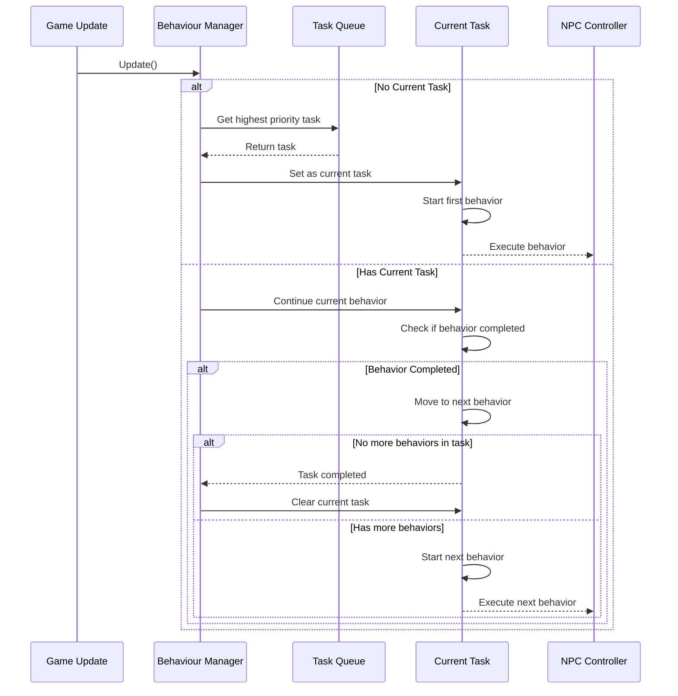

# Chapter 7: Task Management

In [Chapter 6: Navigation System](06_navigation_system_.md), we learned how NPCs find their way around the game world. But what happens when an NPC needs to perform a complex series of actions? For example, a guard might need to patrol an area, investigate suspicious noises, and then return to patrolling. How do we organize these behaviors into meaningful sequences? That's where the **Task Management** system comes in!

## What is Task Management?

Think of Task Management as your NPC's personal to-do list organizer. Just like how you might write down a list of chores (do laundry, wash dishes, take out trash) in order of importance, the Task Management system helps NPCs organize their behaviors in a logical sequence.

For example, an enemy soldier might need to:
1. Go to the player's last known position
2. Search the area
3. Return to patrol if the player isn't found

Without Task Management, programming these sequences would be complicated and difficult to maintain. The Task Management system makes this process much simpler by allowing us to create "tasks" that contain multiple behaviors, prioritize them, and execute them in order.

## Key Components of Task Management

Let's break down the main elements of the Task Management system:

### 1. Tasks: The To-Do Items

A **Task** is like a single item on a to-do list. It represents a specific goal the NPC wants to accomplish, which might require multiple steps:

```csharp
// Creating a simple patrol task
Task patrolTask = behaviourManager.AddTask(1.0f); // Priority 1.0
```

This code creates a new task with a priority of 1.0. The priority determines how important the task is - higher priority tasks will interrupt lower priority ones.

### 2. Behaviors: The Task Steps

Each task consists of one or more **Behaviors** - the individual steps needed to complete the task:

```csharp
// Adding behaviors to our patrol task
Vector3 pointA = new Vector3(10, 0, 0);
Vector3 pointB = new Vector3(-10, 0, 0);

// Step 1: Go to point A
patrolTask.AddBehaviour(new Behaviour(
    BehaviourType.Go, 5, TargetType.Point, pointA));
    
// Step 2: Wait for 3 seconds
patrolTask.AddBehaviour(new Behaviour(
    BehaviourType.Wait, 3));
    
// Step 3: Go to point B
patrolTask.AddBehaviour(new Behaviour(
    BehaviourType.Go, 5, TargetType.Point, pointB));
    
// Step 4: Wait for 3 seconds
patrolTask.AddBehaviour(new Behaviour(
    BehaviourType.Wait, 3));
```

This code adds four behaviors to our patrol task, creating a sequence where the NPC will:
1. Go to point A
2. Wait for 3 seconds
3. Go to point B
4. Wait for 3 seconds

After all behaviors are completed, the task will be removed, and the NPC will move on to the next highest-priority task.

### 3. Task Queue: The Priority List

The Task Management system maintains a queue of pending tasks, sorted by priority:

```csharp
// These tasks will be executed in order of priority (highest first)
// Patrol task (lower priority)
Task patrolTask = behaviourManager.AddTask(1.0f);

// Search task (medium priority)
Task searchTask = behaviourManager.AddTask(2.0f);

// Attack task (highest priority)
Task attackTask = behaviourManager.AddTask(3.0f);
```

In this example, the attack task (priority 3.0) will be executed first, then the search task (priority 2.0), and finally the patrol task (priority 1.0).

## How to Use Task Management

Now let's see how to use Task Management to create a guard NPC that patrols an area and responds to intruders:

### Step 1: Creating a Basic Patrol Task

```csharp
// Get the NPC's behavior manager
NpcController guardController = GetComponent<NpcController>();
BehaviourManager manager = guardController.manager;

// Create a low-priority patrol task
Task patrolTask = manager.AddTask(1.0f);

// Define patrol points
Vector3 pointA = new Vector3(10, 0, 0);
Vector3 pointB = new Vector3(-10, 0, 0);

// Add patrol behaviors
patrolTask.AddBehaviour(new Behaviour(
    BehaviourType.Go, 10, TargetType.Point, pointA));
patrolTask.AddBehaviour(new Behaviour(
    BehaviourType.Wait, 3));
patrolTask.AddBehaviour(new Behaviour(
    BehaviourType.Go, 10, TargetType.Point, pointB));
patrolTask.AddBehaviour(new Behaviour(
    BehaviourType.Wait, 3));
```

This code creates a patrol task with four behaviors. Since it has a low priority (1.0), it will be interrupted by more urgent tasks.

### Step 2: Creating an Investigate Task

When a suspicious noise is heard, we want the guard to investigate:

```csharp
// When a suspicious noise is detected
void OnSuspiciousNoise(Vector3 noisePosition)
{
    // Create a medium-priority investigate task
    Task investigateTask = manager.AddTask(2.0f);
    
    // Go to the noise source
    investigateTask.AddBehaviour(new Behaviour(
        BehaviourType.Go, 
        10, 
        TargetType.Point, 
        noisePosition
    ));
    
    // Look around
    investigateTask.AddBehaviour(new Behaviour(
        BehaviourType.Wait, 
        5
    ));
    
    // After investigation, the NPC will return to patrolling
}
```

Since this investigate task has a higher priority (2.0) than the patrol task (1.0), it will interrupt patrolling. After the investigate task is completed, the NPC will automatically return to the patrol task.

### Step 3: Creating an Attack Task

If an intruder is spotted, we want the guard to attack:

```csharp
// When an intruder is spotted
void OnIntruderSpotted(UniObjectData intruder)
{
    // Create a high-priority attack task
    Task attackTask = manager.AddTask(3.0f);
    
    // Move to the intruder
    attackTask.AddBehaviour(new Behaviour(
        BehaviourType.Go, 
        5, 
        TargetType.Character, 
        intruder
    ));
    
    // Attack the intruder
    attackTask.AddBehaviour(new Behaviour(
        BehaviourType.Attack, 
        10, 
        TargetType.Character, 
        intruder
    ));
}
```

This attack task has the highest priority (3.0), so it will interrupt both investigating (2.0) and patrolling (1.0). After the attack is completed (or if the intruder escapes), the NPC will move on to the next highest-priority task.

## How Task Management Works Internally

Let's see what happens inside the Task Management system when tasks are created and executed:



This diagram shows the process:
1. Every game update, the Behaviour Manager checks if it has a current task
2. If not, it gets the highest priority task from the queue
3. It starts the first behavior in that task
4. When a behavior completes, it moves to the next behavior in the task
5. When all behaviors in a task are completed, it moves to the next highest priority task

Let's look at the key code that makes this happen:

```csharp
public void Update()
{
    // If we don't have a current task, get the next one
    if (task == null)
    {
        GetNextTask();
        
        // If still no task, create a "spare time" task
        if (task == null)
        {
            CreateSpareTimeTask();
        }
    }
    else if (task.behaviour == null)
    {
        // Current task has no behaviors, clear it
        task = null;
    }
    
    // Update the current behavior
    task?.behaviour?.CheckEndTime();
    task?.behaviour?.CheckCompletion();
}
```

This method runs every game update and is the heart of the Task Management system. It:
1. Checks if there's a current task
2. If not, gets the next highest-priority task
3. If there are no tasks, creates a "spare time" task (idle behaviors)
4. Checks if the current behavior is complete
5. If so, moves to the next behavior in the task

## Handling Task Completion and Transitions

When a behavior completes, the system automatically moves to the next behavior in the task:

```csharp
public void GetNextBehaviour()
{
    // Move to the next behavior in the list
    index++;
    
    // If there are more behaviors, start the next one
    if (index < behaviours.Count)
    {
        behaviour = behaviours[index];
        behaviour.Reset();
    }
    else
    {
        // No more behaviors, task is complete
        behaviour = null;
    }
    
    // Notify the system that the behavior has changed
    manager.OnBehaviourChanged();
}
```

This method is called when a behavior completes. It moves to the next behavior in the task, or marks the task as complete if there are no more behaviors.

## The Spare Time Task Feature

One clever feature of the Task Management system is the automatic creation of "spare time" tasks when the NPC has nothing important to do:

```csharp
void CreateSpareTimeTask()
{
    // Create a low-priority spare time task
    task = AddTask(0.25f);
    
    // Randomly choose one of several idle behaviors
    switch (Random.Range(0, 5))
    {
        case 0: // Look at something random
            UniObjectData target = controller.GetRandomTarget();
            task.AddBehaviour(new Behaviour(
                BehaviourType.LookAt, 
                Random.Range(1, 3), 
                TargetType.Character, 
                target));
            break;
            
        case 1: // Just wait a bit
            task.AddBehaviour(new Behaviour(
                BehaviourType.Wait, 
                Random.Range(0, 1)));
            break;
            
        case 2: // Wander around
            (bool isOk, Vector3 position) = controller.GetRandomPosition();
            if (isOk)
            {
                task.AddBehaviour(new Behaviour(
                    BehaviourType.HangAround, 
                    Random.Range(2, 4), 
                    TargetType.Point, 
                    position));
            }
            break;
    }
}
```

This code creates random idle behaviors for NPCs when they have nothing important to do. It's like how people might check their phone or look around when waiting in line - it makes NPCs seem more alive and realistic.

## Practical Example: Creating a Complete Guard AI

Let's put everything together to create a complete guard AI with multiple tasks:

```csharp
void CreateCompleteGuardAI()
{
    // Create the guard GameObject
    GameObject guardObject = new GameObject("Guard");
    NpcController controller = guardObject.AddComponent<NpcController>();
    
    // Initialize the controller
    controller.Init(npcInstance, characterInstance);
    
    // Get the behaviour manager
    BehaviourManager manager = controller.manager;
    
    // 1. Create patrol task (lowest priority)
    Task patrolTask = manager.AddTask(1.0f);
    Vector3 pointA = new Vector3(10, 0, 0);
    Vector3 pointB = new Vector3(-10, 0, 0);
    
    patrolTask.AddBehaviour(new Behaviour(
        BehaviourType.Go, 10, TargetType.Point, pointA));
    patrolTask.AddBehaviour(new Behaviour(
        BehaviourType.Wait, 3));
    patrolTask.AddBehaviour(new Behaviour(
        BehaviourType.Go, 10, TargetType.Point, pointB));
    patrolTask.AddBehaviour(new Behaviour(
        BehaviourType.Wait, 3));
    
    // 2. Set up target detection
    controller.npc.GetPropertyByName("automaticTargeting").Data.b = true;
    controller.npc.GetPropertyByName("targetsTag").Data.s = "Player";
}
```

This code creates a guard NPC that will patrol between two points. When it detects a player (using the [Target System](05_target_system_.md)), other systems like the [Factor Monitoring System](04_factor_monitoring_system_.md) can create higher-priority tasks like attacking or investigating.

## Integration with Other Systems

The Task Management system works closely with other AI systems:

### Connection to the [Behaviour System](01_behaviour_system_.md)

The Task Management system uses the [Behaviour System](01_behaviour_system_.md) to define and execute individual behaviors:

```csharp
// Creating a behavior using the Behaviour System
Behaviour goToBehavior = new Behaviour(
    BehaviourType.Go,     // Behavior type
    5.0f,                 // Duration (seconds)
    TargetType.Point,     // Target type
    targetPosition        // Target data
);

// Adding this behavior to a task
patrolTask.AddBehaviour(goToBehavior);
```

The [Behaviour System](01_behaviour_system_.md) provides the building blocks (individual behaviors), while the Task Management system organizes these blocks into meaningful sequences.

### Connection to the [NPC Controller](02_npc_controller_.md)

When tasks and behaviors are executed, the [NPC Controller](02_npc_controller_.md) handles the actual implementation:

```csharp
private void Manager_OnBehaviourChangedEvent(Behaviour behaviour)
{
    if (behaviour == null) return;
    
    // The NPC Controller implements different behaviors
    switch (behaviour.type)
    {
        case BehaviourType.Go:
            StartNavigation();
            break;
            
        case BehaviourType.Wait:
            StopNavigation();
            break;
            
        case BehaviourType.Attack:
            // Trigger attack animation/logic
            break;
    }
}
```

The Task Management system decides what to do, while the [NPC Controller](02_npc_controller_.md) handles how to do it.

### Connection to the [Factor Monitoring System](04_factor_monitoring_system_.md)

The [Factor Monitoring System](04_factor_monitoring_system_.md) can create tasks based on changes in the NPC's state:

```csharp
private void Database_NewTrigger(BehaviourType type)
{
    switch (type)
    {
        case BehaviourType.Escape:
            // When health is low, create a high-priority escape task
            (bool isOk, Vector3 position) = GetRandomPosition();
            if (isOk)
            {
                manager.AddTask(3).AddBehaviour(new Behaviour(
                    BehaviourType.Escape, 
                    Random.Range(2, 6), 
                    TargetType.Point, 
                    position));
            }
            break;
    }
}
```

This creates a seamless integration where changes in factors (like health) can automatically create appropriate tasks.

## Best Practices for Using Task Management

1. **Use Appropriate Priorities**: Higher priority numbers mean more important tasks. Use a consistent scale (e.g., 1-5) to make your priorities clear.

2. **Keep Tasks Focused**: Each task should represent a single goal or intention. Don't try to cram too many unrelated behaviors into one task.

3. **Use Task Management for Complex Sequences**: For simple behaviors, you might not need tasks. But for sequences of 2+ behaviors, tasks provide better organization.

4. **Clean Up Completed Tasks**: The system automatically removes completed tasks, but you might need to manually cancel tasks that become irrelevant.

5. **Balance Task Complexity**: Very long tasks (many behaviors) might make NPCs seem unresponsive to new events, as they'll complete the entire task before moving on.

## Conclusion

The Task Management system provides a powerful way to organize NPC behaviors into meaningful, prioritized sequences. By combining multiple behaviors into tasks and managing these tasks based on priority, we create NPCs that can handle complex goals while still responding appropriately to changing situations.

This system works hand-in-hand with the other systems we've learned about, creating NPCs that can:
- Follow complex sequences of behaviors (Task Management)
- Execute individual behaviors effectively (Behaviour System)
- Respond to changing internal conditions (Factor Monitoring System)
- Navigate to important locations (Navigation System)
- Find and interact with relevant objects (Target System)
- Display unique personality traits (NPC Personality System)

In the next chapter, [Reactive Behavior Triggers](08_reactive_behavior_triggers_.md), we'll learn how to make NPCs respond immediately to specific events in the game world, creating even more dynamic and responsive AI characters.

---

Generated by [AI Codebase Knowledge Builder](https://github.com/The-Pocket/Tutorial-Codebase-Knowledge)