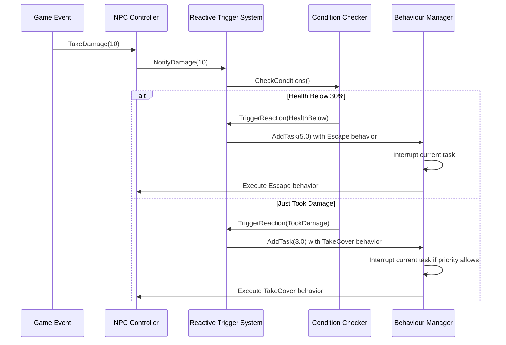

# Chapter 8: Reactive Behavior Triggers

In [Chapter 7: Task Management](07_task_management_.md), we learned how to organize complex sequences of behaviors into coherent tasks. While tasks are great for planned actions, real characters also need to react instantly to unexpected situations. Imagine a soldier who's patrolling - what happens when they suddenly lose half their health from an attack? They shouldn't continue patrolling as if nothing happened! That's where **Reactive Behavior Triggers** come in.

## What are Reactive Behavior Triggers?

Reactive Behavior Triggers are like automatic reflexes for your NPCs. Just as you would instinctively pull your hand away from a hot stove without thinking, these triggers allow NPCs to react immediately to important changes in their state or environment.

Think of them as "if-then" rules:
- **IF** my health drops below 20%
- **THEN** run away and find cover

What makes this system powerful is that once you set up these rules, the NPCs will apply them automatically in any situation - you don't need to manually program every possible scenario.

## Why Do We Need Reactive Behavior Triggers?

Without reactive triggers, NPCs would feel robotic and unresponsive. Imagine these scenarios:

- An enemy soldier continuing to attack even when they're almost dead
- A character standing in fire and not reacting to taking damage
- An NPC running out of ammunition but still trying to shoot

These behaviors break immersion and make NPCs feel unrealistic. Reactive Behavior Triggers solve this problem by connecting important state changes to appropriate responses.

## Key Components of Reactive Behavior Triggers

Let's break down the main elements of this system:

### 1. Trigger Conditions

These are the "if" parts of our rules - the situations we want to detect:

```csharp
// Example trigger conditions
public enum TriggerCondition
{
    HealthBelow,         // Health drops below a threshold
    StaminaDepleted,     // Stamina runs out
    AmmoEmpty,           // Out of ammunition
    TookDamage,          // Just took damage
    TargetLost,          // Lost sight of target
    AllyNeedsHelp        // Nearby ally is in trouble
}
```

Each condition represents a specific situation that might require a response. The system constantly monitors these conditions.

### 2. Reaction Behaviors

These are the "then" parts - what the NPC should do when conditions are met:

```csharp
// Example reactions mapped to conditions
Dictionary<TriggerCondition, BehaviourType> defaultReactions = new()
{
    { TriggerCondition.HealthBelow, BehaviourType.Escape },
    { TriggerCondition.StaminaDepleted, BehaviourType.Wait },
    { TriggerCondition.AmmoEmpty, BehaviourType.ReloadWeapon },
    { TriggerCondition.TookDamage, BehaviourType.TakeCover },
    { TriggerCondition.TargetLost, BehaviourType.Search },
    { TriggerCondition.AllyNeedsHelp, BehaviourType.ProtectAlly }
};
```

This dictionary connects each condition to an appropriate behavior response. When a condition is detected, the corresponding behavior is triggered.

### 3. Priority System

Since multiple conditions might be true simultaneously, we need a way to decide which reaction is most important:

```csharp
// Priority levels for different trigger conditions
Dictionary<TriggerCondition, float> conditionPriorities = new()
{
    { TriggerCondition.HealthBelow, 5.0f },     // Highest priority
    { TriggerCondition.TookDamage, 3.0f },      // High priority
    { TriggerCondition.AmmoEmpty, 2.5f },       // Medium priority  
    { TriggerCondition.StaminaDepleted, 2.0f }, // Medium priority
    { TriggerCondition.TargetLost, 1.5f },      // Lower priority
    { TriggerCondition.AllyNeedsHelp, 1.0f }    // Lowest priority
};
```

Higher priority numbers indicate more urgent reactions. This ensures that critical responses (like escaping when nearly dead) take precedence over less important ones.

## Setting Up Reactive Behavior Triggers

Let's implement a simple reactive system for an enemy NPC that responds to health changes:

### Step 1: Creating the Reactive Trigger System

First, we need to set up the basic structure of our reactive system:

```csharp
// Basic reactive trigger system for an NPC
public class ReactiveSystem
{
    private NpcController controller;
    private Dictionary<TriggerCondition, BehaviourType> reactions;
    private Dictionary<TriggerCondition, float> priorities;
    
    public ReactiveSystem(NpcController controller)
    {
        this.controller = controller;
        
        // Set up default reactions
        reactions = new Dictionary<TriggerCondition, BehaviourType>()
        {
            { TriggerCondition.HealthBelow, BehaviourType.Escape },
            { TriggerCondition.TookDamage, BehaviourType.TakeCover }
        };
        
        // Set up priorities
        priorities = new Dictionary<TriggerCondition, float>()
        {
            { TriggerCondition.HealthBelow, 5.0f },
            { TriggerCondition.TookDamage, 3.0f }
        };
    }
}
```

This code creates a reactive system with two basic triggers: one for low health and one for taking damage. The system knows what behavior to trigger for each condition and how important each reaction is.

### Step 2: Monitoring for Trigger Conditions

Next, we need to constantly check if any conditions are met:

```csharp
// Method to check if conditions are met
public void CheckConditions()
{
    float healthPercent = GetHealthPercentage();
    
    // Check for low health condition
    if (healthPercent < 0.3f) // Below 30% health
    {
        // Health is low, trigger reaction
        TriggerReaction(TriggerCondition.HealthBelow);
    }
    
    // More condition checks would go here...
}

private float GetHealthPercentage()
{
    // Get health from NPC's data
    return controller.database.data[Factor.Health].Data.f / 
           controller.database.maxData[Factor.Health].Data.f;
}
```

This method checks the NPC's health percentage. If it's below 30%, it triggers the appropriate reaction. In a full implementation, we would check many different conditions here.

### Step 3: Triggering Reactions

When a condition is met, we need to create the appropriate reaction:

```csharp
// Method to trigger a reaction based on condition
public void TriggerReaction(TriggerCondition condition)
{
    // If we don't have a reaction for this condition, do nothing
    if (!reactions.ContainsKey(condition))
    {
        return;
    }
    
    // Get the behavior type and priority for this condition
    BehaviourType reaction = reactions[condition];
    float priority = priorities[condition];
    
    // Create a task with appropriate priority
    Task reactionTask = controller.manager.AddTask(priority);
    
    // Add the reaction behavior
    switch (reaction)
    {
        case BehaviourType.Escape:
            // Find a safe position to escape to
            (bool success, Vector3 safePosition) = controller.GetRandomPosition();
            if (success)
            {
                reactionTask.AddBehaviour(new Behaviour(
                    BehaviourType.Escape, 
                    5.0f, // Duration in seconds
                    TargetType.Point, 
                    safePosition));
            }
            break;
            
        // Other reaction types would go here...
    }
}
```

This method creates a task with the appropriate behavior based on the triggered condition. The task's priority ensures that important reactions interrupt less important activities.

## How Reactive Behavior Triggers Work Internally

Let's look at what happens inside the Reactive Behavior Triggers system when an NPC takes damage:



This diagram shows the process:
1. A game event (taking damage) happens to the NPC
2. The NPC Controller notifies the Reactive Trigger System
3. The system checks all relevant conditions
4. If conditions are met, appropriate reactions are triggered
5. The Behaviour Manager creates tasks for the reactions
6. These tasks interrupt current activities based on priority
7. The NPC executes the reaction behaviors

Let's look at the key code that makes this happen:

```csharp
// In NpcController.cs
public void TakeDamage(float damageAmount)
{
    // Update health
    float currentHealth = database.data[Factor.Health].Data.f;
    currentHealth -= damageAmount;
    database.data[Factor.Health].Data.f = currentHealth;
    
    // Notify factor monitoring system
    ExternalEvent((int)Factor.Health, new UniData(-damageAmount));
    
    // Directly check reactive triggers
    reactiveSystem.NotifyDamage(damageAmount);
}
```

This code shows how damage first updates the NPC's health, then notifies both the [Factor Monitoring System](04_factor_monitoring_system_.md) and the Reactive Trigger System. This dual notification is important - the Factor Monitoring System handles gradual changes (like health dropping over time), while the Reactive Trigger System handles immediate reactions to specific events.

## Integration with Other Systems

The Reactive Behavior Triggers system works closely with other AI systems:

### Connection to the [Behaviour System](01_behaviour_system_.md)

When a trigger condition is met, the system creates behaviors using the [Behaviour System](01_behaviour_system_.md):

```csharp
// Creating a behavior in response to a trigger
public void CreateEscapeBehavior()
{
    // Find a safe position
    (bool success, Vector3 safePosition) = controller.GetRandomPosition();
    
    if (success)
    {
        // Create a high-priority escape task
        Task escapeTask = controller.manager.AddTask(5.0f);
        
        // Add escape behavior
        escapeTask.AddBehaviour(new Behaviour(
            BehaviourType.Escape,
            5.0f,
            TargetType.Point,
            safePosition
        ));
    }
}
```

This code creates an escape behavior in response to a trigger and adds it to the [Behaviour System](01_behaviour_system_.md) as a high-priority task.

### Connection to the [Factor Monitoring System](04_factor_monitoring_system_.md)

The Reactive Trigger System complements the [Factor Monitoring System](04_factor_monitoring_system_.md):

```csharp
// Setting up notification between systems
void ConnectSystems()
{
    // Listen to Factor Monitoring System events
    controller.database.NewTrigger += OnFactorSystemTrigger;
}

void OnFactorSystemTrigger(BehaviourType behaviorType)
{
    // The Factor Monitoring System detected a significant change
    // We can add additional reactive logic here if needed
    
    // For example, if health is dropping over time, we might want
    // to proactively seek health items
    if (behaviorType == BehaviourType.Escape)
    {
        reactiveSystem.CheckForHealthItems();
    }
}
```

While the [Factor Monitoring System](04_factor_monitoring_system_.md) handles gradual changes over time (like health slowly dropping), the Reactive Trigger System handles immediate responses to specific events (like taking a large amount of damage at once).

## Practical Example: Creating a Complete Reactive NPC

Let's put everything together to create an enemy soldier with reactive behaviors:

```csharp
void CreateReactiveSoldier()
{
    // Create the NPC GameObject
    GameObject soldierObject = new GameObject("Reactive Soldier");
    
    // Add and set up the NPC Controller
    NpcController controller = soldierObject.AddComponent<NpcController>();
    controller.Init(soldierInstance, characterInstance);
    
    // Create and attach a reactive system
    ReactiveSystem reactiveSystem = new ReactiveSystem(controller);
    
    // Set up the default patrol behavior (low priority)
    Task patrolTask = controller.manager.AddTask(1.0f);
    
    // Add patrol behaviors
    Vector3 pointA = new Vector3(10, 0, 0);
    Vector3 pointB = new Vector3(-10, 0, 0);
    
    patrolTask.AddBehaviour(new Behaviour(
        BehaviourType.Go, 10, TargetType.Point, pointA));
    patrolTask.AddBehaviour(new Behaviour(
        BehaviourType.Wait, 3));
    patrolTask.AddBehaviour(new Behaviour(
        BehaviourType.Go, 10, TargetType.Point, pointB));
    patrolTask.AddBehaviour(new Behaviour(
        BehaviourType.Wait, 3));
        
    // Start checking conditions
    // (In real implementation, this would be called every frame)
    reactiveSystem.CheckConditions();
}
```

This code creates a soldier NPC that patrols between two points. Thanks to the Reactive Trigger System, if the soldier's health drops below 30%, it will interrupt its patrol and run to safety, regardless of what it was doing before.

## Custom Trigger Conditions

You can create custom trigger conditions for unique gameplay needs:

```csharp
// Adding a custom trigger condition
public void AddFlankingTrigger()
{
    // Add a new trigger condition
    reactions[TriggerCondition.PlayerInCover] = BehaviourType.Flank;
    priorities[TriggerCondition.PlayerInCover] = 2.5f;
    
    // Add logic to check for this condition
    playerCoverChecker = StartCoroutine(CheckPlayerCover());
}

private IEnumerator CheckPlayerCover()
{
    while (true)
    {
        // Check if player is behind cover
        if (IsPlayerBehindCover())
        {
            TriggerReaction(TriggerCondition.PlayerInCover);
        }
        
        // Check every half second
        yield return new WaitForSeconds(0.5f);
    }
}
```

This code adds a custom trigger for when the player takes cover. When detected, it triggers a flanking behavior to make the enemy try to get around the player's cover.

## Advanced Condition Expressions

For more complex scenarios, you can combine multiple conditions:

```csharp
// Checking complex conditions
public void CheckAdvancedConditions()
{
    float healthPercent = GetHealthPercentage();
    bool hasAmmo = HasAmmo();
    bool alliesNearby = AreAlliesNearby();
    
    // Complex condition: Low health but has allies nearby - stand ground
    if (healthPercent < 0.3f && alliesNearby)
    {
        TriggerReaction(TriggerCondition.DefendWithAllies);
    }
    // Low health and no allies - escape
    else if (healthPercent < 0.3f && !alliesNearby)
    {
        TriggerReaction(TriggerCondition.HealthBelow);
    }
    
    // No ammo but has allies - call for ammo
    if (!hasAmmo && alliesNearby)
    {
        TriggerReaction(TriggerCondition.RequestAmmo);
    }
    // No ammo and no allies - switch to melee
    else if (!hasAmmo && !alliesNearby)
    {
        TriggerReaction(TriggerCondition.SwitchToMelee);
    }
}
```

This more advanced condition checking creates different reactions based on combinations of factors. For example, low health has different responses depending on whether allies are nearby.

## Customizing Reactions Based on Personality

We can integrate with the [NPC Personality System](03_npc_personality_system_.md) to customize reactions:

```csharp
// Adjusting reactions based on personality
public void TriggerReactionWithPersonality(TriggerCondition condition)
{
    // Get the behavior type for this condition
    BehaviourType reaction = reactions[condition];
    
    // Adjust based on personality
    float aggressiveness = controller.settings.GetCurrentAggresiveness();
    
    // Aggressive characters might attack instead of flee
    if (condition == TriggerCondition.TookDamage && aggressiveness > 70f)
    {
        // Very aggressive - counter-attack instead of taking cover
        reaction = BehaviourType.Attack;
    }
    
    // Create and execute the behavior...
}
```

This code modifies the reaction based on the NPC's personality traits. For example, a highly aggressive character might counter-attack when damaged, while a cautious one would take cover.

## Best Practices for Using Reactive Behavior Triggers

1. **Prioritize Correctly**: Make sure life-threatening conditions have the highest priority - an NPC should always deal with critical health before worrying about running out of ammo.

2. **Don't Overreact**: Avoid triggering major behavioral changes for minor state changes. For example, losing 5% health shouldn't cause an NPC to flee.

3. **Balance Reactivity and Consistency**: NPCs should react to important changes but not constantly switch behaviors. Add small delays or thresholds to prevent erratic behavior.

4. **Personalize Reactions**: Different NPCs should react differently to the same triggers. Use the [NPC Personality System](03_npc_personality_system_.md) to customize reactions.

5. **Consider Multiple Conditions**: The most realistic NPCs will evaluate combinations of factors rather than just individual triggers.

## Conclusion

The Reactive Behavior Triggers system is the final piece that makes our NPCs truly lifelike. It gives them the ability to respond automatically to changing conditions, making appropriate decisions without requiring explicit programming for every possible scenario.

By implementing this system alongside the [Behaviour System](01_behaviour_system_.md), [NPC Controller](02_npc_controller_.md), [NPC Personality System](03_npc_personality_system_.md), [Factor Monitoring System](04_factor_monitoring_system_.md), [Target System](05_target_system_.md), [Navigation System](06_navigation_system_.md), and [Task Management](07_task_management_.md), we've created a comprehensive AI framework that produces intelligent, responsive, and realistic NPCs.

Our NPCs can now:
- Execute complex sequences of behaviors
- Navigate intelligently through the game world  
- Find and interact with appropriate targets
- Monitor their internal state
- Adapt to changing conditions
- Exhibit unique personality traits
- React appropriately to unexpected events

The result is game characters that feel alive, making decisions that surprise and challenge players while still behaving in consistent, believable ways.

---

Generated by [AI Codebase Knowledge Builder](https://github.com/The-Pocket/Tutorial-Codebase-Knowledge)