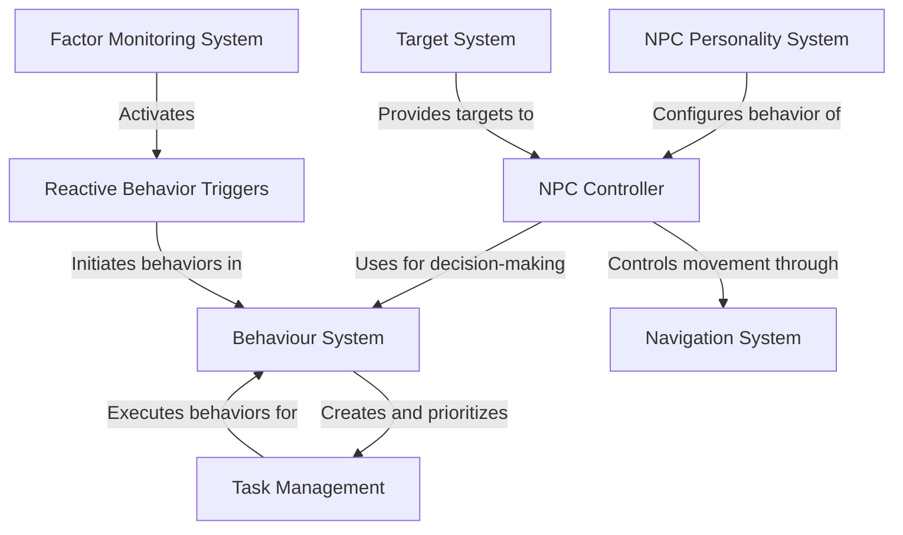

# Tutorial: AI

This project implements an **AI system for non-player characters (NPCs)** in a game. The system creates *realistic and dynamic NPCs* that can make decisions, navigate environments, and respond to changing conditions. At its core, the **Behaviour System** organizes actions into prioritized tasks, while the **NPC Controller** coordinates all capabilities like movement and target selection. NPCs have *personality traits* (aggressiveness, intelligence) that influence their decision-making, and a **Factor Monitoring System** tracks vital statistics like health and stamina to trigger appropriate reactions. This creates characters that can intelligently respond to game situations without needing explicit programming for every scenario.

**Source Repository:** [None](None)

## Chapters

1. [Behaviour System
](01_behaviour_system_.md)
2. [NPC Controller
](02_npc_controller_.md)
3. [NPC Personality System
](03_npc_personality_system_.md)
4. [Factor Monitoring System
](04_factor_monitoring_system_.md)
5. [Target System
](05_target_system_.md)
6. [Navigation System
](06_navigation_system_.md)
7. [Task Management
](07_task_management_.md)
8. [Reactive Behavior Triggers
](08_reactive_behavior_triggers_.md)

---

Generated by [AI Codebase Knowledge Builder](https://github.com/The-Pocket/Tutorial-Codebase-Knowledge)